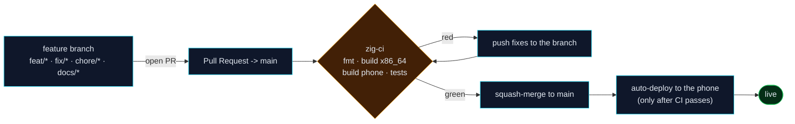

# Contributing & development workflow

This project deploys to **production on every merge to `main`** (a phone running
the server rebuilds itself). Because `main` is production, we do **not** commit
to it directly. We use a lightweight **trunk-based** flow: short-lived branches,
a pull request, CI must pass, then merge.

This is deliberately *not* full GitFlow (no long-lived `develop`/`release`/
`hotfix` branches). For a single maintainer with one production node, that
ceremony costs more than it returns; protected trunk + PRs is the modern best
practice and is what large engineering orgs actually run.

## Branch model



- **`main`** — production. Protected: no direct pushes, PR + green CI required to merge.
- **feature branches** — everything else. Name them by intent:
  `feat/...`, `fix/...`, `chore/...`, `docs/...`, `refactor/...`.

## Day-to-day

```sh
# 1. branch off the latest main
git switch main && git pull
git switch -c fix/short-description

# 2. work, then verify locally BEFORE pushing (any OS, no device needed)
cd zig/hp-server
zig build phone      # cross-compile for the device target (aarch64-linux-android)
zig build test       # unit tests
zig fmt --check src/  # formatting gate (CI enforces this)

# 3. commit and push the branch
git add -p
git commit -m "fix: short description"
git push -u origin fix/short-description

# 4. open a PR and let CI run
gh pr create --fill --base main

# 5. once zig-ci is green, merge (squash). main then auto-deploys.
gh pr merge --squash --delete-branch
```

Use the local `zig build phone` check religiously: CI cross-compiles the exact
device target (`aarch64-linux-android`), so a native build passing on your
laptop is **not** proof it builds on the phone. Catch it before the PR.

## What happens on merge

1. `zig-ci` runs on `main` (format, x86_64 Debug + ReleaseFast, device-target
   build, unit tests).
2. On success, **auto-deploy** triggers (`workflow_run`), calls
   `POST /v1/system/update` on the phone with the `HP_ADMIN_API_KEY` repo
   secret, and the device pulls, rebuilds, and respawns.
3. Commits that touch only scripts/docs skip the rebuild and restart, so docs
   PRs ship with zero downtime.

A red build never reaches the phone: deploy is gated on CI success.

## Conventions

- Keep Zig source pure 7-bit ASCII; shell scripts and `.zig`/`.mjs` stay LF
  (enforced by `.gitattributes`).
- Update the relevant doc in the same PR when behaviour changes
  (`docs/` is canonical; see [`docs/README.md`](docs/README.md)).
- Add a `CHANGELOG.md` entry for anything notable.
- Don't commit secrets. The deploy key lives only in GitHub Actions secrets
  (`HP_ADMIN_API_KEY`) and can be rotated from the Settings page.

## Releasing / hotfix

There is no separate release branch. A "release" is simply a merge to `main`.
For an urgent production fix, branch `fix/...` off `main`, PR, get CI green,
merge — the same path, just fast. If a deploy goes bad, the device's
self-update runs a rollback sentinel that restores the previous binary when the
new one fails its health check.
