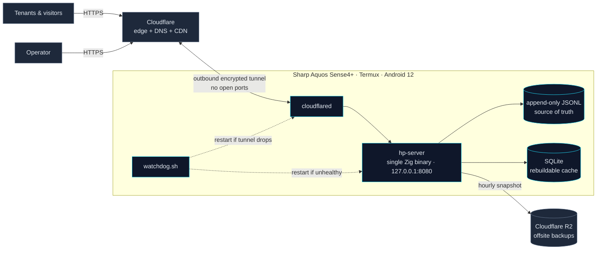
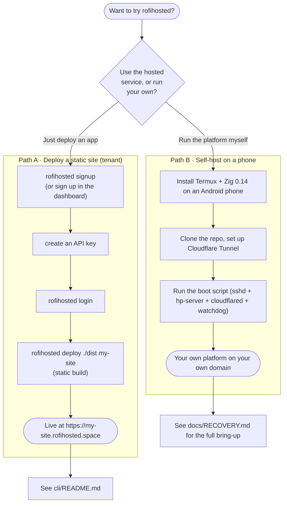

# rofihosted

A self-hosted personal cloud platform that runs on a single Android handset and
is exposed to the public internet through a Cloudflare Tunnel. The entire
server is one Zig binary — no orchestrator, no external database process, no
public IP, and no recurring infrastructure cost.

**Production:** [rofihosted.space](https://rofihosted.space)
**Operator console:** [admin.rofihosted.space](https://admin.rofihosted.space)
**Tenant console:** [app.rofihosted.space](https://app.rofihosted.space)
**Status:** [status.rofihosted.space](https://status.rofihosted.space)

---

## Overview

rofihosted consolidates the capabilities that a developer would normally rent
from several providers — static hosting, full-stack application deployment, a
managed database, authentication-as-a-service, scheduled tasks, secrets
management, and offsite backups — into a single, small, auditable binary
running on commodity hardware that most people already own: a spare phone.



The reference deployment runs on a Sharp Aquos Sense4 Plus (Snapdragon 720G,
8 GB RAM, Android 12) under Termux. The device's battery acts as a built-in
uninterruptible power supply, and the Cloudflare Tunnel provides public
reachability without a static IP or port forwarding.

This is a deliberately small, single-operator system — roughly seven thousand
lines of Zig with no dependencies beyond the [httpz](https://github.com/karlseguin/http.zig)
HTTP framework. It is engineered for correctness and recoverability rather than
horizontal scale.

---

## Surfaces

The platform presents four public hostnames, each with a distinct audience and
access policy. All four are served by the same binary and routed by HTTP `Host`
header.

| Host | Audience | Authentication | Purpose |
|------|----------|----------------|---------|
| `rofihosted.space` | Public | None | Marketing landing page, signup, health, static assets |
| `status.rofihosted.space` | Public | None | System status page backed by live first-party signals |
| `admin.rofihosted.space` | Operator | Session cookie, role = admin | Full operator console: overview, status, files, security, web shell, projects, users, invites, settings |
| `app.rofihosted.space` | Tenants | Session cookie, role = tenant | Scoped console: a tenant's own projects, settings, and API keys |

Access is enforced at two layers: the **host** (the operator host rejects
non-admins; the tenant host redirects admins to the operator host) and the
**route** (sensitive endpoints carry an explicit role check regardless of
host). The session cookie is scoped to `.rofihosted.space`, so a single login
is valid across surfaces, and the post-login destination is chosen by role.

Additional hostnames:

- `<subdomain>.rofihosted.space` — per-project hosting. Static projects are
  served from disk; backend projects are reverse-proxied to a local port. The
  built-in authentication endpoints (`/auth/{signup,login,verify}`) and the
  GitHub webhook (`/v1/github/<id>`) are intercepted here before the project's
  own code runs.
- `www`, `dashboard`, `api`, `files` — redirect to their canonical locations.
- Reserved subdomains (`app`, `www`, `dashboard`, `status`, `api`, `files`,
  `admin`) cannot be claimed by any project.

---

## Capabilities

### Application platform (PaaS)

- Deploy from a Git URL: push to the default branch, an HMAC-verified webhook
  fires, and the server clones, installs, builds, publishes, and (for backends)
  supervises the process with automatic restart and exponential backoff.
- ZIP upload as a Git-free alternative.
- Atomic releases with full history and one-click rollback (symlink swap).
- Per-project encrypted secrets vault (AES-256-GCM, key derived from the
  install pepper and project ID).
- Per-project SQLite database, exposed to the application as `ROFI_DB_PATH`.
- Built-in authentication-as-a-service per project (signup/login/verify,
  HS256 JWTs, per-tenant users table).
- Scheduled tasks (`every Ns/Nm/Nh/Nd` and 5-field cron).
- Per-project RAM quota with two-strike enforcement.

### Operator console

- Real-time overview of process, memory, battery, network, and tunnel health.
- Web shell with persistent working directory, command history, timeouts,
  output caps, and full audit logging — replaces SSH for routine operations.
- Security dashboard: request classifier, blocklist, auto-ban, login attempts,
  behavioural clusters, anomaly alerts, and AI-assisted log analysis.
- File browser, SQL runner, API explorer, and settings.

### Security

- Cookie-based sessions (HMAC-SHA256 with a 32-byte per-install pepper).
- Request classifier (`self` / `unknown` / `bot` / `scanner` / `blocked`) with
  automatic banning of scanners and brute-force login sources.
- Per-IP token-bucket rate limiting and optional country-based geo-blocking.
- Strict security headers on every response.
- Scoped API keys (`sql` / `read` / `admin`) for the `/v1/*` programmatic API,
  stored as salted hashes.
- A signup anti-abuse pipeline combining IP rate limiting, device
  fingerprinting, and email verification.

### Communications

- Transactional email through the Brevo HTTP API (account verification and
  operator notifications), with a safe raw-SMTP fallback.
- Optional Telegram alerts for power events, downtime transitions, and pending
  signups.
- Outbound webhooks for internal events.

### Reliability and operations

- A shell watchdog with an HTTP health probe and an RSS ceiling.
- A power monitor that alerts and flushes state on charger disconnect.
- A tunnel-health watchdog.
- Hourly offsite backups to Cloudflare R2 plus rotated local snapshots.
- GitHub Actions auto-deploy on every push to the default branch.

### AI (optional)

Eleven opt-in features powered by the Mistral API — auto-ban annotation, IP
explanation, daily digests, weekly policy review, a honeypot, a
natural-language query bar, behavioural embeddings and clustering, anomaly
detection, observability, and log scrubbing — all of which degrade gracefully
to a fully functional server when no API key is configured.

---

## Technology

| Layer | Choice |
|-------|--------|
| Language | Zig 0.14 |
| HTTP / SSE | httpz (karlseguin/http.zig) |
| Runtime | Termux on Android 12 (Bionic libc) |
| Ingress | Cloudflare Tunnel (`cloudflared`) |
| DNS / CDN | Cloudflare |
| Database | SQLite via a persistent CLI subprocess pool |
| Crypto | Zig standard library (HMAC-SHA256, AES-256-GCM) |
| Typeface | SF Pro Display (subset, self-hosted woff2) |
| AI (optional) | Mistral |
| Email | Brevo HTTP API |
| CI | GitHub Actions (format, build, unit tests) |

---

## Operating model

Two cooperating processes run on the device: the `hp-server` binary and a shell
watchdog that restarts it (and `cloudflared`) if either becomes unhealthy.
Inside the server, a worker pool handles HTTP while background threads perform
uptime probing, log rotation, SSE keepalives, statistics ticks, scheduled AI
jobs, tunnel-health polling, and periodic backups.

All persistent data lives under `~/data/` as append-only JSON Lines, treated as
the source of truth; the SQLite cache is a rebuildable, derived index.
Configuration and secrets live in mode-600 files outside the repository and are
never committed.

---

## Getting started

There are two ways to use rofihosted: deploy your app to the hosted instance as
a tenant, or run the whole platform on your own spare phone.



### Path A — deploy a site (tenant)

Tenant accounts get **static hosting, a managed per-project database, and
authentication-as-a-service**. Backend (process-executing) apps are deployed by
the operator only — see the note below. Create a project and deploy a static
build from the dashboard at `app.rofihosted.space`, or with the CLI:

```sh
npm install -g rofihosted        # installs both 'rofihosted' and the 'rh' alias
rofihosted login                 # paste your API key (from the dashboard)
rofihosted deploy ./dist my-site # upload a static build
#   -> https://my-site.rofihosted.space
```

Everyday commands: `rh status`, `rh ls`, `rh logs <sub>`, `rh secret set <sub> <key>`,
`rh sql <sub> "<query>"`. Full reference in [`cli/README.md`](cli/README.md).

> **Why backends are operator-only:** every process on the device shares one
> Termux user, so a deployed backend could read the install pepper and thus all
> tenants' secrets. Until true isolation exists (a separate compute device),
> running arbitrary backend code is restricted to the operator. See
> [`docs/SECURITY.md`](docs/SECURITY.md).

### Path B — run your own instance

You need an Android phone with [Termux](https://termux.dev/), a Cloudflare
account (free tier is fine) with a domain, and Zig 0.14. The end-to-end
bring-up — packages, tunnel, boot scripts, and first build — is documented step
by step in [`docs/RECOVERY.md`](docs/RECOVERY.md), which doubles as the
disaster-recovery runbook.

To build and verify locally before pushing (from any OS):

```sh
cd zig/hp-server
zig build phone        # cross-compile for the device target (aarch64-linux-android)
zig build test         # run the unit tests
```

---

## Documentation

| Document | Contents |
|----------|----------|
| [`docs/ARCHITECTURE.md`](docs/ARCHITECTURE.md) | System design, request lifecycle, module map, storage model |
| [`docs/SECURITY.md`](docs/SECURITY.md) | Threat model, authentication, secrets handling, controls |
| [`docs/OPERATIONS.md`](docs/OPERATIONS.md) | Day-to-day operations, deploy workflow, incident playbooks |
| [`docs/API.md`](docs/API.md) | Endpoint reference (session and API-key) |
| [`docs/RECOVERY.md`](docs/RECOVERY.md) | Disaster recovery onto a fresh device |
| [`docs/ENGINEERING-REVIEW.md`](docs/ENGINEERING-REVIEW.md) | Prioritized improvement backlog |
| [`cli/README.md`](cli/README.md) | `rh` command-line client |
| [`CHANGELOG.md`](CHANGELOG.md) | Release history |

A documentation index is maintained at [`docs/README.md`](docs/README.md).

---

## Status

This is a personal, single-operator system and is not intended to scale beyond
one node. The code is intentionally small, dependency-light, and kept in pure
7-bit ASCII so that source transfers over arbitrary channels do not corrupt it.
End-to-end verification is performed with `scripts/test-everything.sh`.

## License

MIT. See [`LICENSE`](LICENSE).
