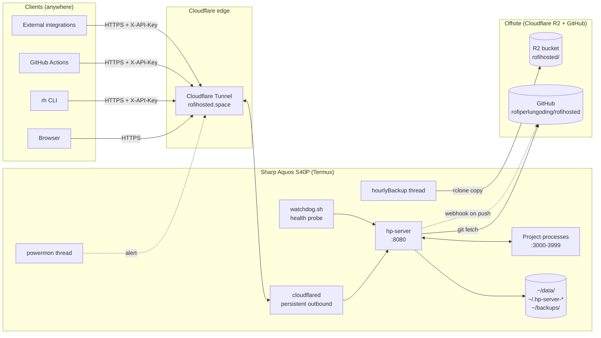

# rofihosted

A "kingdom of one" personal cloud running on an old Sharp Aquos Sense4 Plus phone, exposed to the public internet via Cloudflare Tunnel. Single Zig binary, ~3&nbsp;MB RSS idle, no public IP, no port forward.

Live at [rofihosted.space](https://rofihosted.space). Authenticated console at [app.rofihosted.space](https://app.rofihosted.space). Static sites and full-stack apps deploy at any [`<sub>.rofihosted.space`](https://blog.rofihosted.space).

## What it is

Netlify + Vercel + Supabase + Railway, in a single Zig binary, on your phone. Plus a built-in web shell that replaces SSH from anywhere.

Push a repo to GitHub. Open `app.rofihosted.space/projects`, click `+ New project`, pick a subdomain, choose a runtime (static/node/python/bun/generic), paste install + build + start commands, drop in env-var secrets. Click Create. The server clones, builds, and (for backends) supervises the process 24/7 with auto-restart. Push again to GitHub: webhook fires, redeploy runs, zero downtime. The same dashboard gives you per-project SQL runner, scheduled tasks, ZIP upload as a fallback when you don't want to git, atomic rollback to any prior release, encrypted secrets vault, RAM cap per project, and built-in auth-as-a-service (signup/login/verify endpoints with JWT).

When you're not at your laptop, hit `app.rofihosted.space/shell` from any browser. It's a real terminal: arrow-up history, persistent cwd, command timeouts, output truncation, audit logging. Replaces SSH for 95% of operator workflows.

For scripted operations, install the `rh` CLI (`npm install -g cli/`):

```sh
rh status                 # battery, mem, disk, uptime, version
rh update                 # git pull + rebuild on the phone
rh deploy ./mysite mysub  # zip + auto-detect runtime + upload + live URL
rh ls                     # list projects
rh logs mysub             # tail build + runtime logs
rh backup --r2            # snapshot to R2 offsite
```

GitHub Actions auto-deploys on every push to main: `.github/workflows/auto-deploy.yml` calls `/v1/system/update` with an admin API key, the phone fetches, rebuilds (or no-op for script-only commits), respawns, and CI verifies.

## Operator surfaces

There are four ways to manage the system:

| Surface | Auth | When to use |
|---------|------|-------------|
| Dashboard at `app.rofihosted.space` | Session cookie | Day-to-day project work, settings, viewing logs |
| Web shell at `app.rofihosted.space/shell` | Same cookie | Replaces SSH for arbitrary commands |
| `rh` CLI on laptop | X-API-Key (admin scope) | Scripted ops, CI, deploys, status checks |
| GitHub Actions | Repository secret | Auto-deploy on every push to main |

Direct SSH still works (key-based, port 8022) but is no longer required for any documented workflow.

## Project lifecycle

```
git push -> GitHub webhook (HMAC-verified) -> /v1/github/<id>
                                                |
              Operator clicks Deploy or         v
              Upload ZIP, or webhook fires -> builder.deployAsync(id)
                                                |
             clone/pull -> install -> build -> publish
                                                |
                            atomic ln -sfn current -> releases/<UTC ts>/
                                                |
                            (backend) supervisor.restart(id)
                                                |
                            child process: PORT, ROFI_PROJECT_ID,
                                           ROFI_SUBDOMAIN, ROFI_DB_PATH,
                                           NODE_ENV, ...secrets vault
                                                |
              <sub>.rofihosted.space proxies HTTP/1.1 to 127.0.0.1:<port>
                                                |
                            cron loop runs scheduled tasks alongside
```

## Feature inventory

### Core platform
- Single Zig 0.14 binary (httpz) on port 8080, ~17 MB binary, ~3 MB RSS idle, ~30 MB warm
- Cookie-based session auth (HMAC-SHA256 with 32-byte random pepper, 7&nbsp;day TTL, HttpOnly + Secure + SameSite=Lax)
- Per-IP token-bucket rate limiter
- Request classifier: `self` / `unknown` / `bot` / `scanner` / `blocked`
- Auto-ban (3 scanner hits in 10 min; 5 failed logins in 15 min)
- Geo-block toggle (cf-ipcountry driven, off by default)
- Strict HTTP security headers on every response
- Real-time SSE event bus for live UI updates
- Audit log of every operator action

### Operator console (replaces SSH)
- Web dashboard at `app.rofihosted.space` with Overview, Status, Files, API, Projects, Shell, Security, Settings tabs
- Web shell at `/shell` with persistent cwd, command history, timeout enforcement, 256 KB output cap, quick-action chips for common ops
- `rh` CLI (Node 18+) at `cli/rh.mjs`: status, update, deploy, ls, logs, backup, power, whoami
- GitHub Actions auto-deploy workflow (`.github/workflows/auto-deploy.yml`)
- Self-update via dashboard button or `rh update` (git fetch + rsync + rebuild + respawn)
- Smart no-restart for script-only commits (Zig builds are skipped when only scripts/docs change)

### Reliability
- Process supervisor (`scripts/watchdog.sh`) with HTTP /health probe and 384&nbsp;MB RSS ceiling on hp-server itself
- Per-project process supervisor with auto-restart, exponential backoff, pidfile-based orphan reaping across hp-server restarts
- Per-project RAM quota (`rss_limit_mb`) with two-strike SIGTERM enforcement
- Power monitor (`powermon.zig`) polling battery_status every 30s, fires Telegram alert + runs `sync` on charger disconnect
- Tunnel health watchdog with healthy/degraded/offline classification
- Sticky red banner on every dashboard page when device is discharging

### Backups
- `scripts/backup-quick.sh`: tar.gz of registry + per-project DBs + secrets vaults to `~/backups/`, rotated to last 14
- `scripts/backup-r2.sh`: rclone copy to Cloudflare R2, rotated to last 168 (7 days hourly)
- `hourlyBackupLoop` thread inside hp-server fires backup-r2 every 3600s
- Settings page Backups card: trigger local or R2 backup, list both, validate restorable
- `scripts/backup.sh` (legacy): age-encrypted backup with passphrase

### Telemetry
- Background uptime checker, append-only JSONL store with 5s buffered writes, optional Telegram notifications
- SQLite read-side cache for fast AI query bar with persistent sqlite3 worker pool (5x lower per-query latency vs spawning per call)
- Operator rule engine (JSON DSL with 4 triggers and 3 action types)
- API key manager: scoped tokens (`sql`, `read`, `admin`) hashed with SHA-256+pepper
- Outbound webhook dispatcher: configure URL + event subscription, get POSTed `{event, ts, payload}` envelopes

### Hosting
- Static site hosting at `*.rofihosted.space` with atomic symlink deploys, per-site LRU cache, SPA fallback
- **Projects PaaS**: full Netlify-style with wizard-driven onboarding
  - Per-project subdomain (`<sub>.rofihosted.space`)
  - Per-project encrypted secrets vault (AES-256-GCM, key from pepper + project_id)
  - GitHub auto-deploy via HMAC-verified webhook (`/v1/github/<project_id>`)
  - ZIP upload fallback (no git required, `POST /api/projects/upload?id=`)
  - Atomic deploys with releases history and one-click rollback
  - Build pipeline: clone -> install -> build -> publish, with stdout+stderr captured
  - Process supervisor: spawn `start_cmd` with secrets + ROFI_* env injection, auto-restart on crash with exponential backoff
  - HTTP/1.1 reverse proxy from subdomain to allocated port
  - Built-in **auth-as-a-service**: `/auth/{signup,login,verify}` per project, HS256 JWTs, per-project SQLite users table, signing key derived from pepper + project_id
  - Built-in **per-project SQLite database** at `~/data/dbs/<project_id>.db`, exposed as `ROFI_DB_PATH` env var
  - **SQL runner UI** in the project detail panel, Supabase-style
  - **Scheduled tasks (cron)** with `every Ns/Nm/Nh/Nd` and 5-field cron expressions; tasks inherit secrets and ROFI_* env
  - Auto-injected env: `PORT`, `ROFI_PROJECT_ID`, `ROFI_SUBDOMAIN`, `ROFI_DB_PATH`, `HOST`, `NODE_ENV=production`
  - Boot-time auto-restart of any project that was running at last shutdown
  - "Site paused" page when a project is stopped
  - Live RSS pill on detail panel (color-grades amber at 75%, red at 90%)
  - last_kill_reason tracking (operator / crash / rss_quota)

### AI
- 11 AI features (annotation, explain streaming + structured, daily digest, weekly policy review with reflection, honeypot, natural-language query bar, embeddings + behavioural clusters, anomaly detection, AI observability, log scrubbing, prompt-injection defense)
- AI project analyzer suggests deploy config (runtime, install/build/start, expected env vars) from a repo URL

### Other
- Self-hosted icon font (no cdnjs dependency at runtime)

## Why a phone

Sharp Aquos Sense4 Plus has Snapdragon 720G, 8&nbsp;GB RAM, 4120&nbsp;mAh battery (built-in UPS). Idle, the binary uses around 3&nbsp;MB RSS and the device draws negligible power on AC. Cheaper than a Raspberry Pi, with on-device LTE fallback if WiFi drops.

## Topology



```
Internet
   |
   v
Cloudflare edge (Singapore HA: sin07/09/16/20/22)
   |
   v
cloudflared (Go, prebuilt binary, run via proot for DNS+CA bind)
   |
   v
hp-server :8080 (single Zig binary)
   |
   +-- /proc reads (self stats, meminfo)
   +-- termux-api subprocess (battery, wifi)
   +-- cloudflared :20241/metrics scrape
   +-- persistent sqlite3 worker pool -> ~/data/cache.db (read-side cache)
   +-- on-demand sqlite3 -> ~/data/dbs/<id>.db (per-project DB + auth users + SQL runner)
   +-- spawned project subprocesses (Node/Python/Bun/...) <-> :3000-3999
   +-- (optional) Mistral API for AI features
   +-- (optional) curl subprocess fan-out -> webhook URLs
   +-- (optional) rclone subprocess -> Cloudflare R2 (hourly backup + ad-hoc)
   |
   +-- ~/data/{visits,uptime,logins,audit,digests,policy,scrub,anomalies,ai-calls}.jsonl
   +-- ~/data/cache.db                                     (rebuildable from visits.jsonl)
   +-- ~/data/embeddings.bin                               (1024-dim vectors, LRU)
   +-- ~/data/dbs/<project_id>.db                          (per-project SQLite)
   +-- ~/data/projects/<project_id>/{repo,releases,current,secrets.bin,logs,runtime.pid}
   +-- ~/hosted/sites/<sub>/{releases,current}             (legacy static-only sites, pre-Projects)
   +-- ~/backups/rofihosted-<ts>.tar.gz                    (last 14 local snapshots)
   +-- ~/.hp-server-creds.txt, blocklist, secret.bin, geoblock, honeypot, env, rules, apikeys, webhooks, projects, cron, audit (mode 600 each)
```

## Routing

| Host | Routes |
| --- | --- |
| `rofihosted.space` | Public landing, static asset endpoints, `/health` |
| `app.rofihosted.space` | Private console (auth required): pages and `/api/*` JSON. Also handles `/v1/*` X-API-Key endpoints. |
| `<sub>.rofihosted.space` | First: project router. If a project owns this subdomain and `runtime=static`, serve from `~/data/projects/<id>/current/`. If `runtime=node/python/bun/generic`, reverse-proxy to `127.0.0.1:<port>`. Auth endpoints (`/auth/{signup,login,verify}`) intercepted before the project's own code so it never sees raw passwords. Also serves `/v1/github/<id>` GitHub webhooks (HMAC-verified). Falls back to legacy `~/hosted/sites/<sub>/current/` if no project claims the subdomain. |
| `dashboard/status/api/files.rofihosted.space` | 301 to `app.rofihosted.space/...` (legacy) |
| `www.rofihosted.space` | 301 to `rofihosted.space` |

Reserved subdomains (`app`, `www`, `dashboard`, `status`, `api`, `files`) cannot be claimed by any project.

## Tech stack

- Zig 0.14.0
- [httpz](https://github.com/karlseguin/http.zig) for HTTP/SSE
- Termux on Android 12 (Bionic libc, no glibc)
- Cloudflare Tunnel (`cloudflared` Go binary, run via `proot`)
- Cloudflare Registrar for the domain, Cloudflare for DNS (wildcard CNAME for `*.rofihosted.space`)
- `sqlite3` CLI as a persistent subprocess pool (no libsqlite3 linking, Termux/Bionic friendly)
- Mistral (small + medium + embed) for optional AI features
- `age` for encrypted backups
- `git` for project repo clones
- `unzip` for ZIP-upload deploys
- `curl` subprocess for outbound webhooks and Telegram

## Repository layout

```
zig/hp-server/
  build.zig
  build.zig.zon
  src/
    main.zig          - HTTP routing, request lifecycle, signal handlers, AI/digest/policy dispatch
    auth.zig          - HMAC-SHA256 session cookies (with pepper), file-backed creds
    secret.zig        - Random pepper persisted to ~/.hp-server-secret.bin
    security.zig      - Classifier, blocklist, autoban, login tracker, security headers
    geoblock.zig      - Country-based filtering (cf-ipcountry), opt-in
    audit.zig         - Append-only operator-action log
    events.zig        - SSE pub/sub bus + optional fan-out callback for webhooks
    sysmon.zig        - /proc readers (self + meminfo)
    hostinfo.zig      - termux-api subprocess scrapers + cloudflared metrics
    tunnel_health.zig - Periodic cloudflared metrics poll, restart-request flag
    powermon.zig      - Battery polling, charger-disconnect alerts, sync on unplug
    uptime.zig        - Periodic HTTP probes, transition detection
    store.zig         - JSONL append-only with size-bounded rotation
    writebuf.zig      - 5s buffered writer for visits.jsonl
    rules.zig         - Operator rule engine (JSON DSL)
    dbcache.zig       - SQLite read-side cache, 5-min incremental sync
    dbpool.zig        - Persistent sqlite3 -batch worker pool
    pathsafe.zig      - Strict path/subdomain validators + realpath escape check
    hosted.zig        - Legacy static-site hosting at *.rofihosted.space (pre-Projects)
    apikey.zig        - Scoped tokens (sql/read/admin) for /v1/* endpoints
    webhook.zig       - Outbound HTTP webhook fan-out
    projects.zig      - Project registry (~/.hp-server-projects.jsonl), rss_limit_mb included
    projsecrets.zig   - AES-256-GCM secrets vault per project
    builder.zig       - Deploy orchestrator: clone/pull, install, build, publish, ZIP unpack, rollback
    supervisor.zig    - Per-project process supervisor with auto-restart, RSS quota, pidfile-based orphan reaping
    proxy.zig         - HTTP/1.1 reverse proxy to project ports
    projauth.zig      - Per-project auth-as-a-service (signup/login/verify, HS256 JWT)
    cron.zig          - Scheduled tasks per project ('every Ns', 5-field cron)
    ratelimit.zig     - Token bucket per IP
    files.zig         - Directory listing for /files page
    badge.zig         - SVG status badges (shields.io style)
    telegram.zig      - Optional notifier (spawns curl)
    embeddings.zig    - 1024-dim vectors + LRU + cosine clustering
    honeypot.zig      - AI-generated decoy content for scanners
    query.zig         - Function-call planner for the AI query bar
    ai.zig            - Mistral client + per-feature rate limit + caches
    templates/        - All HTML, CSS, JS, woff2 (embedded into binary)
                        Includes app-shell.html (web shell), app-projects.html with RAM quota slider
cli/                  - rh CLI (Node 18+) for laptop ops
  rh.mjs              - status, update, deploy, ls, logs, backup, etc
  package.json
  README.md
scripts/              - Termux setup, boot, watchdog, backup, tunnel ops, deploy helper
  backup-quick.sh     - Local snapshot tarball (last 14)
  backup-r2.sh        - Local snapshot + rclone copy to Cloudflare R2 (last 168)
  r2-setup.sh         - Configure rclone for R2 (interactive or env-driven)
  self-update.sh      - git fetch + rsync + rebuild + respawn (called by /api/system/update)
  test-everything.sh  - 48-check verification suite (run after any change)
docs/
  OPERATIONS.md       - Day-to-day manual with mermaid diagrams
  API.md              - Complete endpoint reference
  RECOVERY.md         - Disaster recovery on fresh phone
  ARCHITECTURE.md     - Module-level rationale
  SECURITY.md         - Threat model
  PROJECT-BRIEFING.md - Context-transfer doc
.github/workflows/
  zig-ci.yml          - Zig fmt + Debug + ReleaseFast on every push
  auto-deploy.yml     - Triggers /v1/system/update on the phone after every push to main
```

## Documentation

- [`docs/OPERATIONS.md`](docs/OPERATIONS.md) - Day-to-day operator manual: workflows, incident playbooks, verification matrix, mermaid diagrams of every flow
- [`docs/API.md`](docs/API.md) - Complete endpoint reference: session-cookie + X-API-Key, scopes, response shapes, cache headers
- [`docs/RECOVERY.md`](docs/RECOVERY.md) - Disaster recovery on a fresh phone, step-by-step
- [`docs/ARCHITECTURE.md`](docs/ARCHITECTURE.md) - Module-level rationale and decisions
- [`docs/SECURITY.md`](docs/SECURITY.md) - Threat model, secrets handling, audit
- [`docs/PROJECT-BRIEFING.md`](docs/PROJECT-BRIEFING.md) - Comprehensive context-transfer document
- [`cli/README.md`](cli/README.md) - rh CLI install + usage

## Status

This is a personal home server. Nothing here is meant to scale beyond one user. The code is intentionally small (~7000 lines of Zig) and avoids dependencies aside from httpz. Source files are pure 7-bit ASCII so transfers over arbitrary pipes do not corrupt them.

The system is verified end-to-end via `scripts/test-everything.sh` (48 tests across auth, infra, system, v1, project lifecycle, deploy pipeline, backup, powermon, audit). Run it any time:

```sh
ssh hp 'bash ~/test-everything.sh'
```

Update history: [`CHANGELOG.md`](CHANGELOG.md).

## License

MIT. See [`LICENSE`](LICENSE).
