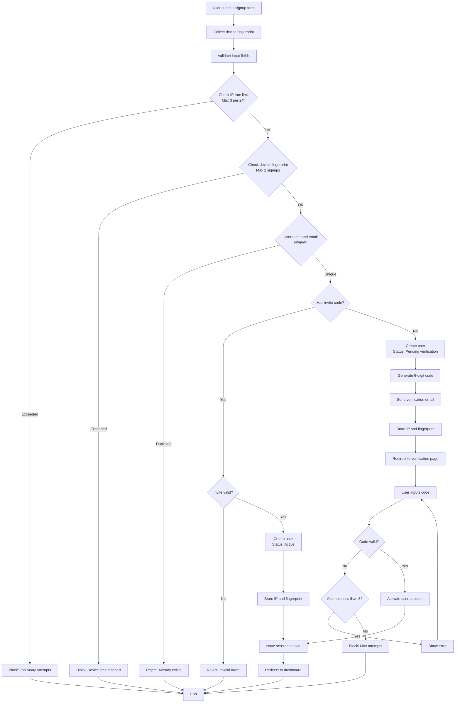
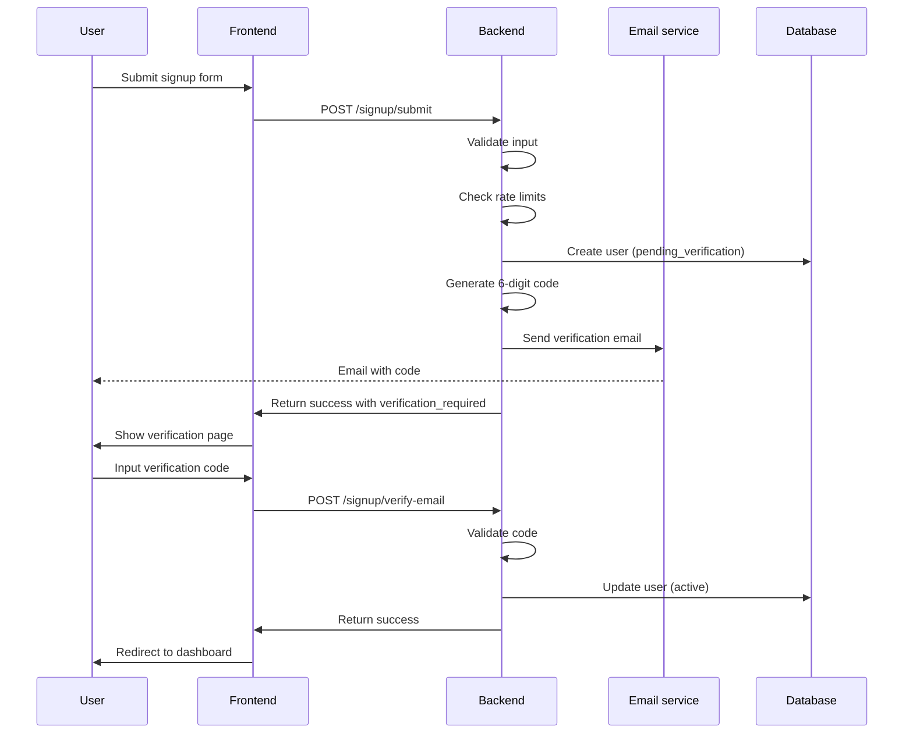
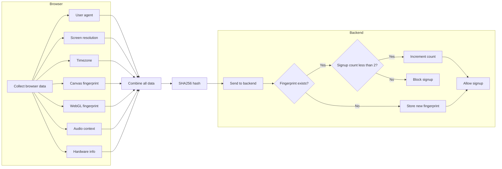
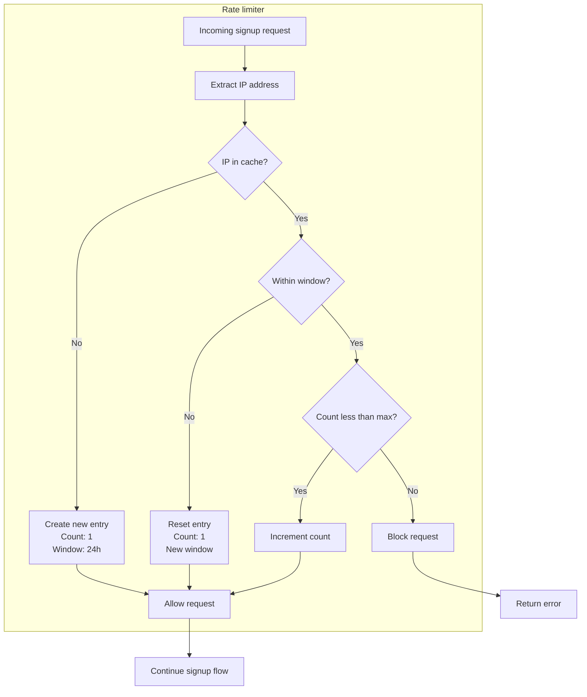
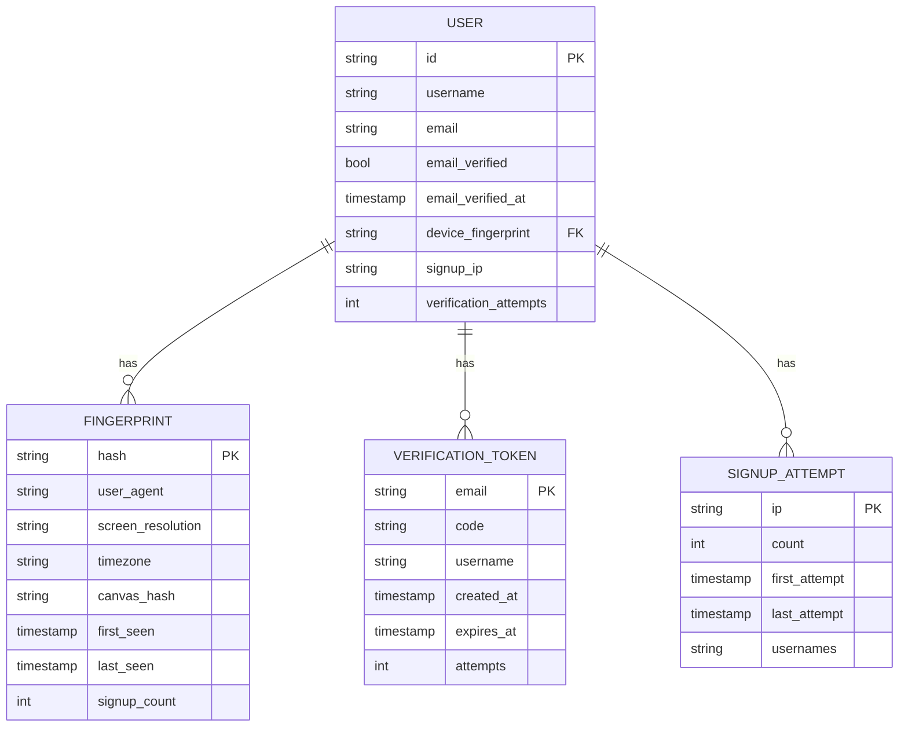
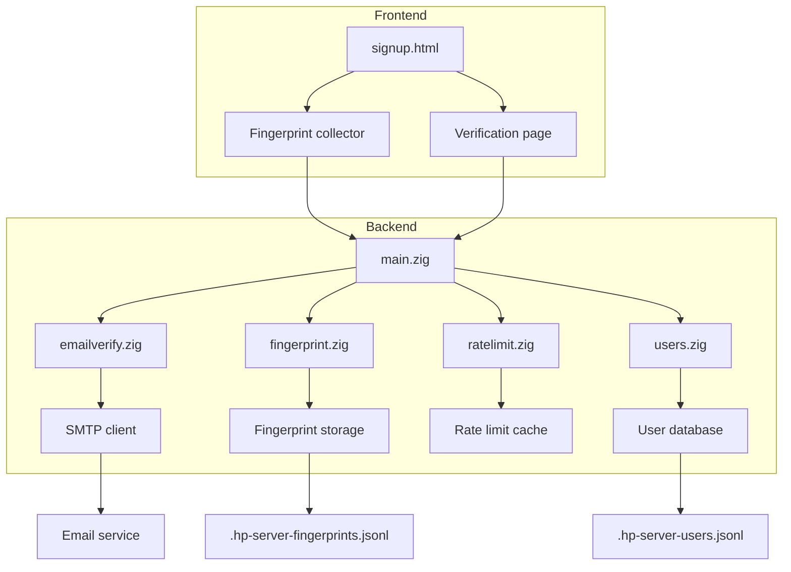
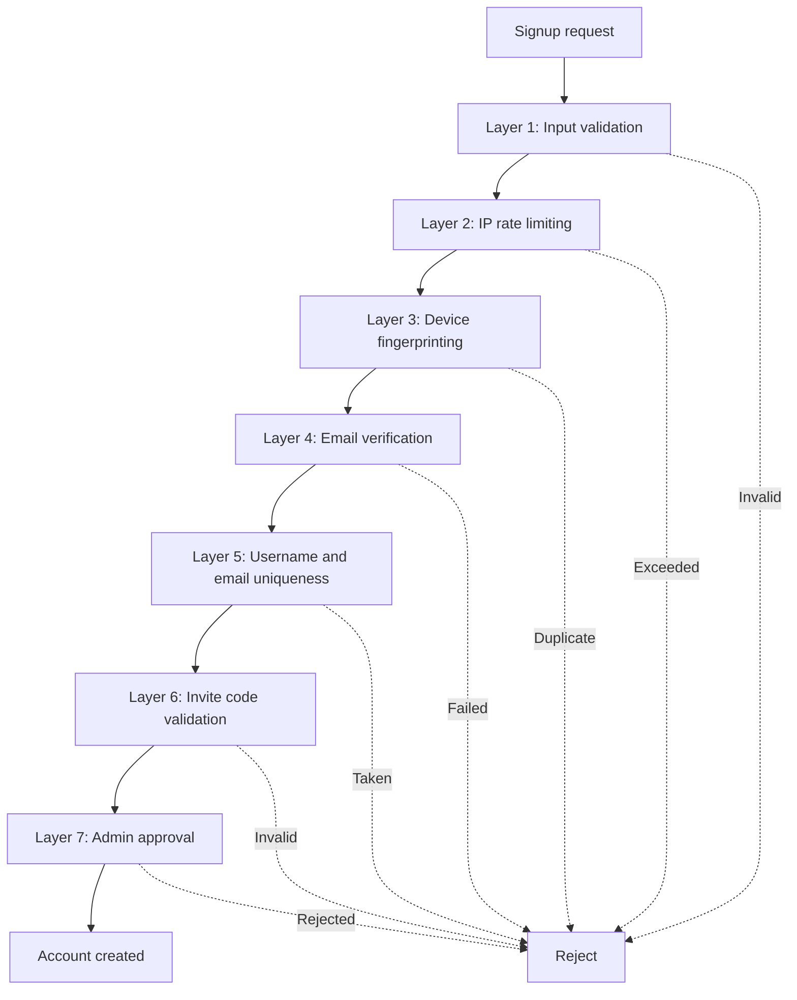
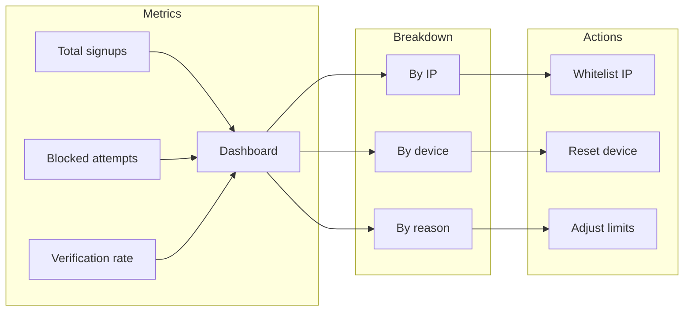

# Anti-duplicate account system: flow diagrams

## Complete signup flow

## Email verification flow

## Device fingerprinting process

## Rate limiting architecture

## Data storage structure

## Component architecture

## Security layers

## Monitoring dashboard (future)

---

**Legend**:
- Solid lines = Success path
- Dashed lines = Blocked or rejected
- PK = Primary key
- FK = Foreign key