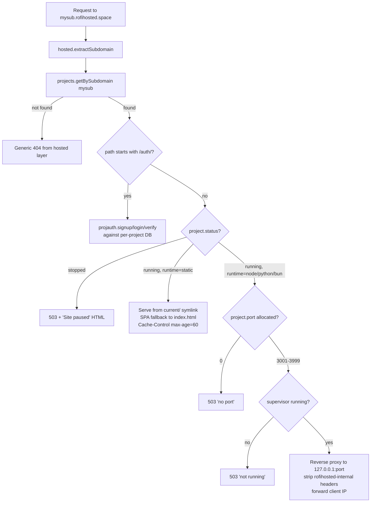

# API Reference

Complete reference for all HTTP endpoints exposed by hp-server. Two
authentication modes:

- **Session cookie** (`/api/*`, `/login/submit`, page routes): set by
  POST to `/login/submit` with `username` and `password`. Lasts until
  logout or pepper rotation.
- **X-API-Key header** (`/v1/*`): created via `POST /api/apikeys/create`,
  scoped to `read`, `sql`, or `admin`. Lifetime is forever unless
  revoked.

All responses are JSON unless otherwise noted. Standard error envelope:

```json
{ "ok": false, "err": "error_code", "detail": "optional human string" }
```

---

## Auth model

```mermaid
flowchart LR
  user[User / browser] -->|POST username + password| submit[/login/submit/]
  submit -->|302 + Set-Cookie| user
  user -->|GET with cookie| any_api[any /api/*]
  any_api --> guard{guard middleware}
  guard -->|cookie valid| handler[Handler runs]
  guard -->|invalid| redir[302 -> /login]

  cli[rh CLI / CI] -->|X-API-Key| v1[/v1/*]
  v1 --> verify[apikey.verify]
  verify -->|hash matches| scope{scope check}
  scope -->|admin| handler2[Admin handler]
  scope -->|sql| sqlh[SQL handler]
  scope -->|insufficient| reject403[403 scope_required]
  verify -->|missing or invalid| reject401[401 invalid_api_key]
```

---

## Public endpoints (no auth)

### `GET /health`
Returns `200 ok` plain text. Used by the watchdog to detect liveness.

### `GET /` (apex `rofihosted.space`)
Static landing page.

### `GET /login`
Login form. Submits to `/login/submit`.

### `POST /login/submit`
Form: `username`, `password`. Returns `302` to `/?` on success (sets
`Set-Cookie: hp_session=...`), or `302` back to `/login?err=...` on fail.

### `GET /logout`
Clears session cookie, redirects to `/login`.

### `POST /v1/github/<project_id>`
GitHub webhook endpoint. HMAC-verified using `webhook_secret` from the
project registry. Triggers a deploy when `ref == refs/heads/<branch>`.

---

## Session-cookie endpoints (`/api/*`)

All require an active session. Returns `302 -> /login` if not authenticated.

### Project lifecycle

#### `GET /api/projects`
Returns all projects.

**Response:**
```json
{
  "ok": true,
  "projects": [
    {
      "id": "8370a1250bd015a9",
      "name": "cvandriesatria",
      "subdomain": "cvandriesatria",
      "repo_url": "https://github.com/...",
      "branch": "main",
      "runtime": "static",
      "install_cmd": "npm ci",
      "build_cmd": "npm run build",
      "start_cmd": "",
      "publish_dir": "dist",
      "webhook_secret": "...",
      "port": 0,
      "status": "running",
      "rss_limit_mb": 0,
      "created_at": 1779950318,
      "updated_at": 1779950352,
      "last_deploy_at": 1779950352
    }
  ]
}
```

#### `POST /api/projects/create`
Form fields:
- `name` (required): human-friendly name, 1-64 chars
- `subdomain` (required): `[a-z0-9-]{1,63}`
- `runtime` (required): `static` | `node` | `python` | `bun` | `generic`
- `repo_url` (optional): git URL for clone-based deploys
- `branch` (default `main`)
- `install_cmd` `build_cmd` `start_cmd` `publish_dir` (optional)
- `rss_limit_mb` (optional): u32, 0 = no limit

**Response:**
```json
{ "ok": true, "id": "abc123...", "port": 3001 }
```

**Errors:** `subdomain_taken`, `invalid_subdomain`, `invalid_name`,
`invalid_runtime`, `port_exhausted`.

#### `POST /api/projects/update`
Form: `id` plus any subset of mutable fields (`name`, `repo_url`,
`branch`, `install_cmd`, `build_cmd`, `start_cmd`, `publish_dir`,
`rss_limit_mb`).

**Errors:** `not_found`, `invalid_name`.

#### `POST /api/projects/delete`
Form: `id` (required), `purge=true` (optional).

Without `purge`: just removes the registry entry. Working tree, DB, and
secrets vault stay on disk.

With `purge`: also `deleteTreeAbsolute(~/data/projects/<id>/)` and
`deleteFileAbsolute(~/data/dbs/<id>.db[-wal,-shm])`.

#### `POST /api/projects/start` / `stop` / `restart`
Form: `id`.

**Static project:** flips registry `status` field.
- `start`: status=running, subdomain serves files normally
- `stop`: status=stopped, subdomain serves "Site paused" page (HTTP 503)
- `restart`: status=running

**Backend project:** delegates to supervisor.
- `start`: spawn child process if not running
- `stop`: SIGTERM (5s grace) → SIGKILL, set last_kill_reason=operator
- `restart`: stop, sleep 1.5s, start (delay lets TIME_WAIT clear)

**Errors:** `not_found`, `static_project`, `not_running`,
`already_running`, `no_start_cmd`.

#### `POST /api/projects/deploy`
Form: `id`. Triggers `~/rebuild.sh` style pipeline:
1. `git fetch + reset --hard origin/<branch>` (or skip if no repo_url)
2. Run `install_cmd`
3. Run `build_cmd`
4. For static: copy `<publish_dir>` to `releases/<ts>/`, atomic-swap `current/` symlink
5. For backend: SIGTERM old process, spawn new

Builds run in a detached thread; the API returns immediately with
`{"ok": true, "triggered": true}`. Watch progress via `/api/projects/logs`.

#### `GET /api/projects/logs?id=<id>` / `runtime-logs?id=<id>`
Returns the build or runtime log as plain text inside JSON:

```json
{ "ok": true, "log": "rofihosted deploy: project=...\n=== clone === [..." }
```

#### `GET /api/projects/status?id=<id>`
Returns supervisor state:

```json
{
  "ok": true,
  "state": "running",
  "pid": 30040,
  "started_at": 1779970450,
  "crash_count": 0,
  "last_exit": 0,
  "rss_kb": 145000,
  "rss_mb": 141,
  "rss_limit_mb": 256,
  "last_kill_reason": "none"
}
```

`last_kill_reason` values: `none`, `operator`, `crash`, `rss_quota`.

#### `POST /api/projects/upload?id=<id>`
Body: `application/zip`. Upload a static project release.

Server unpacks to `releases/<ts>/`, atomic-swaps `current/`. Returns
`{"ok":true}` on success.

### Project secrets

#### `GET /api/projects/secrets/list?id=<id>`
Returns the keys (not values) in the project's encrypted vault.

```json
{ "ok": true, "keys": ["DATABASE_URL", "STRIPE_KEY"] }
```

#### `POST /api/projects/secrets/set`
Form: `project_id`, `key`, `value`. Adds or overwrites a secret. Stored
AES-256-GCM encrypted at `~/data/projects/<id>/secrets.bin`, decrypted
only at process spawn time and injected as env vars.

#### `POST /api/projects/secrets/delete`
Form: `project_id`, `key`.

### Project SQL (built-in DB per project)

#### `POST /api/projects/sql`
Body (JSON): `{"project_id": "...", "sql": "SELECT * FROM users"}`.

Runs against the project's SQLite at `~/data/dbs/<id>.db`. Uses sqlite3
subprocess pool (3 hot workers).

#### `GET /api/projects/tables?id=<id>`
Lists tables in the project's DB.

#### `GET /api/projects/users?id=<id>`
Lists users (from the built-in auth table created by projauth on first signup).

### Cron tasks

#### `GET /api/projects/cron/list?project_id=<id>`
List scheduled tasks.

#### `POST /api/projects/cron/create`
Form: `project_id`, `name`, `schedule` (e.g. `every 1h`), `command`.

#### `POST /api/projects/cron/delete` / `run` / `toggle`
Form: `id`.

### AI helpers

#### `POST /api/projects/preview-repo`
Body (JSON): `{"repo_url": "https://github.com/...", "branch": "main"}`.
Shallow-clones to a temp dir, runs detection heuristics, returns suggested
runtime + commands without committing.

#### `POST /api/projects/analyze`
Same body. Calls Mistral with the repo metadata and returns a structured
deploy config (runtime, install/build/start cmds, expected env vars,
concerns, optimizations). Costs API tokens.

### System operations (replaces SSH)

#### `POST /api/system/exec`
Body (JSON): `{"cmd": "...", "cwd": "/optional/path", "timeout_ms": 60000}`.

Runs `sh -c "<cmd>"` on the phone. Caps:
- Command 8 KB max
- Output 256 KB per stream (truncated flag set)
- Default 60s timeout, max 5 min
- Watcher thread sends SIGTERM at deadline, SIGKILL 2s later

**Response:**
```json
{
  "ok": true,
  "exit_code": 0,
  "timed_out": false,
  "elapsed_ms": 121,
  "stdout": "...",
  "stderr": "...",
  "stdout_truncated": false,
  "stderr_truncated": false,
  "cwd": "/data/data/com.termux/files/home"
}
```

Audit logged.

#### `GET /api/system/info`
```json
{
  "ok": true,
  "battery_pct": 90,
  "battery_status": "FULL",
  "mem_total_kb": 7755152,
  "mem_avail_kb": 5063240,
  "disk_total_mb": 95643,
  "disk_free_mb": 82044,
  "system_uptime_s": 240000,
  "home": "/data/data/com.termux/files/home"
}
```

#### `GET /api/system/power`
```json
{
  "ok": true,
  "available": true,
  "percentage": 90,
  "status": "full",
  "status_raw": "FULL",
  "last_check_unix": 1780010627,
  "is_plugged": true,
  "transitions_unplug": 0,
  "transitions_replug": 0
}
```

#### `GET /api/system/version`
```json
{
  "ok": true,
  "local_sha": "33fbc22",
  "local_subject": "chore: gitignore local commit-message scratch files",
  "remote_sha": "33fbc22",
  "remote_subject": "...",
  "last_fetch_unix": 1779970889,
  "binary_built_unix": 1780010520,
  "up_to_date": true
}
```

#### `POST /api/system/update`
Triggers `~/self-update.sh`. Three possible outcomes:

- `{"ok":true,"reason":"already_up_to_date","head":"..."}` (<1s)
- `{"ok":true,"reason":"updated","status":"no_restart_needed",...}` (script-only commits)
- `{"ok":true,"reason":"updated","status":"restarting",...}` (Zig changes)

The connection often gets severed when hp-server restarts. Clients should
treat 524 / aborted as "probably succeeded" and verify via `/api/system/version`.

#### `POST /api/system/backup?target=local|r2|auto`
Triggers `~/backup-quick.sh` (local) or `~/backup-r2.sh` (R2 + local).
`auto` means R2 if configured, else local.

#### `GET /api/system/backups`
```json
{
  "ok": true,
  "local": [
    { "name": "rofihosted-20260528-191538.tar.gz", "size": 1378, "mtime": 1779967053 }
  ],
  "remote": [
    { "name": "rofihosted-20260528-185400.tar.gz", "size": 1378 }
  ],
  "r2_configured": true
}
```

#### `POST /api/system/restore-test?source=local|r2`
Downloads (R2) or reads (local) the latest tarball, extracts to a temp
dir, validates it contains a registry and DBs, returns counts.

```json
{
  "ok": true,
  "tarball": "rofihosted-20260528-185400.tar.gz",
  "size_bytes": 1378,
  "registry_lines": 0,
  "db_count": 1,
  "db_total_bytes": 8192,
  "source": "r2"
}
```

### Other endpoints

- `GET /api/me` - current user info
- `GET /api/audit?limit=100` - recent audit log entries
- `GET /api/visits?limit=100` - recent HTTP visits
- `GET /api/dbcache/stats`
- `GET /api/dbpool/stats`
- `GET /api/apikeys` / `POST /api/apikeys/create` / `POST /api/apikeys/revoke`
- `GET /api/webhooks` / `POST /api/webhooks/create` / `POST /api/webhooks/delete`
- `GET /api/rules` / `POST /api/rules/save`
- `GET /api/hosted/stats` / `GET /api/hosted/list` / `POST /api/hosted/refresh`
- `GET /api/tunnel/health`
- `GET /api/geoblock` / `POST /api/geoblock/update`
- `POST /api/projects/log-stream?id=<id>` (SSE)
- `POST /api/projects/rollback` form: `id`, `release_ts`
- `GET /api/projects/releases?id=<id>`

---

## X-API-Key endpoints (`/v1/*`)

All require `X-API-Key` header. Scope enforced per endpoint.

### Identity

#### `GET /v1/whoami` (any scope)
```json
{ "ok": true, "name": "ci-test-key", "id": "abc123..." }
```

### SQL (scope: `sql`)

#### `POST /v1/execute`
Body (JSON): `{"db": "notes", "sql": "SELECT * FROM notes"}`.

Runs SQL against `~/data/dbs/<db>.db`. Returns rows or error.

### System (scope: `admin`)

All these mirror their `/api/system/*` counterparts:
- `GET /v1/system/version`
- `GET /v1/system/info`
- `GET /v1/system/power`
- `POST /v1/system/update`
- `POST /v1/system/backup?target=local|r2`

### Project management (scope: `admin`)

- `GET /v1/projects` (list)
- `POST /v1/projects/create` (form-encoded same fields as /api/projects/create)
- `GET /v1/projects/status?id=<id>`
- `GET /v1/projects/logs?id=<id>` / `/v1/projects/runtime-logs?id=<id>`
- `POST /v1/projects/deploy` (form: id)
- `POST /v1/projects/upload?id=<id>` (body: application/zip)

### Scope error response

If a key lacks the required scope:

```json
{ "ok": false, "err": "scope_required", "scope": "admin" }
```

HTTP 403.

---

## Subdomain routing (`*.rofihosted.space`)

Requests with `Host: <sub>.rofihosted.space` (other than reserved
subdomains `app`, `api`, `www`, `static`) are routed to projects:



### Built-in project auth at `<sub>.rofihosted.space/auth/*`

These are intercepted by hp-server before reverse proxying, so the
project's own code never sees raw passwords:

- `POST /auth/signup` body `{"email": "...", "password": "..."}` → returns JWT
- `POST /auth/login` same body → returns JWT
- `GET /auth/verify` with `Authorization: Bearer <jwt>` → returns user info

Each project gets its own SQLite users table at `~/data/dbs/<project_id>.db`.

---

## Cache headers

| Resource | Cache-Control |
|----------|---------------|
| HTML pages (`/`, `/projects`, etc) | `no-store, must-revalidate` |
| `/theme.css`, `/theme.js`, `/app.css`, `/app.js` | `public, max-age=3600` (versioned via `?v=N`) |
| `/icons.css` | `public, max-age=86400` |
| `Simple-Line-Icons.woff2` | `public, max-age=2592000` (30 days) |
| Static project assets | `public, max-age=60` |
| Status badge SVG | `max-age=60` |
| Paused page | `no-store, must-revalidate` |

---

## Response time expectations

| Endpoint class | Typical | Worst case |
|----------------|---------|------------|
| `/health` | 5ms | 50ms |
| `/api/projects` | 10ms | 100ms |
| `/api/system/info` | 80-150ms (battery + disk subprocess calls) | 500ms |
| `/api/system/exec` | command-dependent | timeout_ms |
| `/api/system/backup local` | 100-300ms | 1s |
| `/api/system/backup r2` | 1-5s (network upload) | 30s |
| `/api/system/update` (no-op) | 500ms | 2s |
| `/api/system/update` (script-only) | 1-3s | 10s |
| `/api/system/update` (full rebuild) | 30-90s | exceeds Cloudflare 524 |
| `/api/projects/upload` | depends on zip size | 60s for 50MB |
| `/api/projects/sql` | 5-20ms (pooled) | 200ms |
| `<sub>.rofihosted.space/<asset>` | 10-50ms | 500ms |
| Reverse proxy (backend project) | depends on project | bounded by httpz timeout |
