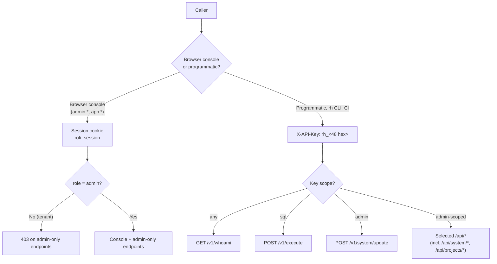
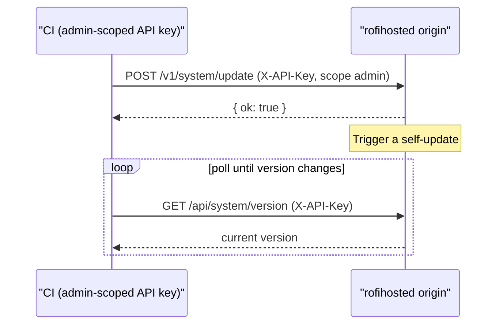

# API Reference

This document is the endpoint reference for rofihosted. Endpoints are grouped
by the surface that serves them and by authentication scheme. Request and
response bodies are JSON unless noted.

---

## 1. Authentication schemes

| Scheme | Header / mechanism | Used by |
|--------|--------------------|---------|
| Session cookie | `rofi_session` (HMAC-signed; `Secure`, `HttpOnly`, `SameSite=Lax`, domain `.rofihosted.space`) | Browser console (`admin.*`, `app.*`) |
| API key | `X-API-Key: rh_<48 hex>` | Programmatic `/v1/*` access, the `rh` CLI, CI |
| GitHub HMAC | `X-Hub-Signature-256` over the body, per-project secret | Project deploy webhooks |
| Project JWT | `Authorization: Bearer <token>` (HS256, per-project key) | A hosted project's own users |

Console endpoints require a valid session cookie. Admin-only endpoints
additionally require `role = admin`; tenants receive `403`. Selected `/api/*`
endpoints also accept an admin-scoped API key so the CLI and CI can call them
without a browser session.

The diagram below summarises how a caller authenticates and how API-key scopes gate access:



---

## 2. Public endpoints (no authentication)

Served on the apex (`rofihosted.space`) unless noted.

| Method | Path | Description |
|--------|------|-------------|
| GET | `/health` | Liveness probe. Returns `ok`. Available on every host. |
| GET | `/` | Public landing page. |
| GET | `/signup` | Signup page. |
| POST | `/signup/submit` | Create an account (subject to the anti-abuse pipeline). |
| POST | `/signup/check-invite` | Validate an invite code. |
| GET | `/signup/pending` | Holding page for accounts awaiting approval. |
| GET | `/signup/verify` | Email verification page. |
| POST | `/signup/verify-email` | Submit a verification code. |
| POST | `/signup/resend-verification` | Resend a verification code. |
| GET | `/login`, POST `/login/submit` | Authentication (served on both consoles). |
| GET | `/theme.css`, `/app.css`, `/icons.css`, `/theme.js`, `/app.js` | Static assets (cached, CORS-enabled). |
| GET | `/fonts/SFProDisplay-{400,500,600,700,800}.woff2`, `/fonts/Simple-Line-Icons.woff2` | Self-hosted fonts. |

### Public status (`status.rofihosted.space`)

| Method | Path | Description |
|--------|------|-------------|
| GET | `/` | Public status page. |
| GET | `/api/status` | Live status JSON (see below). |

`GET /api/status` response:

```json
{
  "ok": true,
  "overall": "operational",
  "updated_at": 1780000000,
  "history_from": 1780000000,
  "history_to": 1780060000,
  "history_lat": [3, 4, -1, ...],
  "components": [
    {
      "group": "Core Platform",
      "name": "Web & dashboard",
      "status": "operational",
      "latency_ms": 3,
      "history": "uuuduu...n",
      "uptime": 99.42
    }
  ]
}
```

`overall` and each component `status` are one of `operational`, `degraded`,
`down`. `history` is a string of per-bucket states (`u` up, `d` down,
`g` degraded, `n` no data) spanning `history_from`..`history_to`;
`history_lat[i]` is the average latency in milliseconds for bucket `i`
(`-1` when there is no data). The public overall reflects only first-party
signals (web reachability and the live tunnel), never external reference
probes.

---

## 3. Console API (session cookie)

Served on `admin.rofihosted.space` (and, for tenant-scoped data, on
`app.rofihosted.space`). Selected read endpoints and all `/api/system/*` and
`/api/projects/*` endpoints also accept an admin-scoped API key.

### Identity and telemetry

| Method | Path | Description |
|--------|------|-------------|
| GET | `/api/me` | Current identity: username, user id, role, status. |
| GET | `/api/stream` | Server-Sent Events stream of live events. |
| GET | `/api/stats` | Process, memory, and capability stats. |
| GET | `/api/host` | Battery and Wi-Fi (via Termux API). |
| GET | `/api/tunnel`, `/api/tunnel/health` | Cloudflare tunnel metrics and watchdog state. |
| GET | `/api/visits` | Recent requests. |
| GET | `/api/uptime` | Latest uptime probe results. |
| GET | `/api/audit` | Operator action log. |
| GET | `/metrics` | Server metrics. |

### Security (admin)

| Method | Path | Description |
|--------|------|-------------|
| GET | `/api/security` | Full security dashboard data. |
| POST | `/api/security/block`, `/api/security/unblock` | Manual blocklist control. |
| GET/POST | `/api/geoblock`, `/api/geoblock/update` | Geo-block state. |
| GET/POST | `/api/honeypot`, `/api/honeypot/update` | Honeypot toggle. |
| GET/POST | `/api/rules`, `/api/rules/replace` | Operator rule engine. |

### Files, cache, AI

| Method | Path | Description |
|--------|------|-------------|
| GET | `/api/files/list?path=` | Directory listing. |
| GET | `/api/dbcache/stats`, `/api/dbcache/sync` | Read-side cache stats / manual sync. |
| GET | `/api/dbpool/stats` | SQLite worker-pool stats. |
| POST | `/api/ai/explain`, `/api/ai/explain/stream` | Explain an IP (structured / streaming). |
| GET/POST | `/api/ai/digest/latest`, `/api/ai/digest/run` | Daily digest. |
| GET/POST | `/api/ai/policy/latest`, `/api/ai/policy/run` | Weekly policy review. |
| POST | `/api/ai/query` | Natural-language query bar. |
| GET | `/api/ai/usage`, `/api/ai/scrub` | AI usage stats / log scrub. |
| GET | `/api/embeddings/clusters`, `/api/embeddings/stats` | Behavioural clusters. |

### Administration (admin only)

| Method | Path | Description |
|--------|------|-------------|
| GET/POST | `/api/users`, `/api/users/*` | User management (approve, reject, suspend). |
| GET/POST | `/api/invites`, `/api/invites/*` | Invite management. |
| GET/POST | `/api/apikeys`, `/api/apikeys/create`, `/api/apikeys/revoke` | API key lifecycle. |
| GET/POST | `/api/webhooks`, `/api/webhooks/create`, `/api/webhooks/delete` | Outbound webhooks. |
| GET/POST | `/api/system/{info,power,version,backup,backups,update,restore-test}` | System operations. |
| POST | `/api/system/exec` | Web-shell command execution (audited). |
| POST | `/settings/change` | Change credentials. |

### Projects

| Method | Path | Description |
|--------|------|-------------|
| GET | `/api/projects` | List projects. |
| POST | `/api/projects/{create,update,delete}` | Project lifecycle. |
| POST | `/api/projects/deploy` | Trigger a deploy. |
| POST | `/api/projects/upload?id=` | ZIP upload (raw `application/zip` body). |
| GET | `/api/projects/logs?id=`, `/api/projects/runtime-logs?id=` | Build / runtime logs. |
| GET | `/api/projects/releases?id=`; POST `/api/projects/rollback` | Releases and rollback. |
| POST | `/api/projects/{start,stop,restart}`; GET `/api/projects/status?id=` | Supervisor control. |
| POST | `/api/projects/sql` | SQL runner against the per-project database. |
| GET | `/api/projects/cron/list?project_id=`; POST `/api/projects/cron/{create,delete,toggle,run}` | Scheduled tasks. |
| GET/POST | `/api/projects/secrets/{list,set,delete}` | Per-project secrets vault. |

### Status badges

| Method | Path | Description |
|--------|------|-------------|
| GET | `/badge/<name>.svg`, `/badge.svg` | shields.io-style status badges. |

---

## 4. Programmatic API — `/v1/*` (API key)

Authenticated with `X-API-Key`. Available on the console hosts.

| Method | Path | Scope | Description |
|--------|------|-------|-------------|
| GET | `/v1/whoami` | any | Returns `{name, id}` of the calling key. |
| POST | `/v1/execute` | `sql` | Body `{db, sql}`; returns `{ok, db, result}`. `db` must match `[a-z0-9_-]`. Output uses SQLite JSON mode. Caps: 8 MB response, 64 KB SQL. Audited. |
| POST | `/v1/system/update` | `admin` | Trigger a self-update. Used by CI. |

A representative CI self-update flow using these endpoints:



### Project-facing (no operator auth)

Served on `<sub>.rofihosted.space`, intercepted before the project's own code:

| Method | Path | Description |
|--------|------|-------------|
| POST | `/v1/github/<project_id>` | GitHub push webhook (HMAC-SHA256 verified). |
| POST | `/auth/signup` | `{email, password}` → `{user_id, token}`. |
| POST | `/auth/login` | `{email, password}` → `{user_id, token}`. |
| GET | `/auth/verify` | With `Authorization: Bearer <token>` → `{user_id}`. |

---

## 5. Conventions

- Successful JSON responses include `"ok": true`; errors include
  `"ok": false` and an `"err"` code.
- Mutating endpoints are audited.
- Read endpoints set cache headers appropriate to their volatility; console
  pages are served `no-store` so UI logic is never stale after a deploy.
- All endpoints are reached over HTTPS through the Cloudflare Tunnel; the
  origin listens only on localhost.
