# Engineering Review and Improvement Backlog

**Project:** rofihosted (hp-server)
**Document type:** Technical review and prioritized remediation backlog
**Status:** Authoritative — supersedes ad-hoc notes in prior audit files
**Audience:** Maintainer/operator and any future contributor

---

## 1. Executive Summary

rofihosted is a single-binary personal cloud platform written in Zig 0.14,
running on an Android handset under Termux and exposed to the public internet
through a Cloudflare Tunnel. For a system of its ambition — a full
platform-as-a-service, an operator console, a security pipeline, and an
AI-assisted observability layer in roughly seven thousand lines of code — the
codebase is unusually disciplined. Append-only storage as the source of truth,
a per-install cryptographic pepper, a dedicated path-safety module, atomic
release swaps, and an encrypted per-project secrets vault are all evidence of
deliberate engineering.

This review identifies **eighteen improvement items** across reliability,
security, performance, maintainability, testing, and documentation. None of
them indicate that the system is unsafe to operate today; rather, they
represent the gap between "works for one operator" and "demonstrably correct,
observable, and maintainable over time."

The single most consequential cluster of issues concerns **operational
robustness of the deployment and process-supervision model**: the server is
rebuilt on the device itself, and the scripts that supervise and restart the
process use inconsistent process-matching patterns, which has already produced
duplicate instances competing for the listening port. These should be
addressed first because they affect availability directly.

Findings are grouped into four priority tiers (P0–P3). Each item states the
observation, its impact, and a concrete recommendation.

The full backlog at a glance, grouped by the four priority tiers defined above:

```mermaid
flowchart TB
    BL(["Prioritized backlog · grouped by tier"])
    BL --> P0
    BL --> P1
    BL --> P2
    BL --> P3

    subgraph P0["P0 · Critical — affects availability/correctness; address first"]
        direction TB
        P0_1["P0-1 · Inconsistent process-match patterns<br/>cause duplicate server instances"]
        P0_2["P0-2 · On-device compilation is a<br/>single point of deploy failure"]
        P0_3["P0-3 · External uptime probes are unreliable<br/>on Termux and emit false alerts"]
    end

    subgraph P1["P1 · High — security, reliability, maintainability"]
        direction TB
        P1_1["P1-1 · Hardcoded Termux absolute paths<br/>throughout the codebase"]
        P1_2["P1-2 · Thread-per-request work spawning<br/>is unbounded"]
        P1_3["P1-3 · Client IP is derived from<br/>spoofable headers as a fallback"]
        P1_4["P1-4 · Content Security Policy permits<br/>unsafe-inline"]
        P1_5["P1-5 · Thin automated test coverage;<br/>no integration tests in CI"]
    end

    subgraph P2["P2 · Medium — robustness, clarity, performance under growth"]
        direction TB
        P2_1["P2-1 · main.zig is a single<br/>~8,000-line module"]
        P2_2["P2-2 · SQLite and outbound HTTP<br/>run as subprocesses"]
        P2_3["P2-3 · Multi-tenancy is partially implemented"]
        P2_4["P2-4 · Rate limiter fails open and holds<br/>a global lock during cleanup"]
        P2_5["P2-5 · Observability stops at<br/>JSONL files and Telegram"]
    end

    subgraph P3["P3 · Low — hygiene and polish"]
        direction TB
        P3_1["P3-1 · Documentation sprawl and drift"]
        P3_2["P3-2 · Manual asset cache-busting<br/>is error-prone"]
        P3_3["P3-3 · Silent error suppression in places"]
        P3_4["P3-4 · Plaintext secrets file vs. encrypted<br/>project vault inconsistency"]
    end

    classDef p0 fill:#0f172a,stroke:#f87171,color:#e2e8f0;
    classDef p1 fill:#0f172a,stroke:#fbbf24,color:#e2e8f0;
    classDef p2 fill:#0f172a,stroke:#22d3ee,color:#e2e8f0;
    classDef p3 fill:#1e293b,stroke:#64748b,color:#e2e8f0;
    class P0_1,P0_2,P0_3 p0;
    class P1_1,P1_2,P1_3,P1_4,P1_5 p1;
    class P2_1,P2_2,P2_3,P2_4,P2_5 p2;
    class P3_1,P3_2,P3_3,P3_4 p3;
```

---

## 2. Methodology and Scope

This review is based on a direct reading of the server source
(`zig/hp-server/src/`), the operational shell scripts (`scripts/`), the CI
workflow, and the runtime behaviour observed during recent deployments. It
covers:

- HTTP routing and request lifecycle (`main.zig`)
- Authentication and session management (`auth.zig`, `users.zig`)
- Security pipeline (`security.zig`, `ratelimit.zig`, `pathsafe.zig`)
- API-key issuance and verification (`apikey.zig`)
- Storage and caching (`store.zig`, `dbcache.zig`, `dbpool.zig`)
- Uptime monitoring and tunnel health (`uptime.zig`, `tunnel_health.zig`)
- Deployment and supervision (`scripts/*.sh`, `builder.zig`, `supervisor.zig`)

Out of scope: a line-by-line audit of every module, formal threat modelling,
and load testing. Where a finding would benefit from such work, it is noted.

### Severity definitions

| Tier | Label | Meaning |
|------|-------|---------|
| **P0** | Critical | Affects availability or correctness in normal operation; address first. |
| **P1** | High | Material risk to security, reliability, or long-term maintainability. |
| **P2** | Medium | Worth doing; improves robustness, clarity, or performance under growth. |
| **P3** | Low | Hygiene and polish; low risk, low urgency. |

---

## 3. Prioritized Findings

### P0 — Critical

#### P0-1 — Inconsistent process-match patterns cause duplicate server instances

**Area:** Reliability / Process supervision
**Observation:** The scripts that start, stop, and supervise the server do not
agree on how they identify the process. `watchdog.sh` matches `pgrep -f
'hp-server$'` (anchored), whereas `start-zig-server.sh` uses `pkill -f
'hp-server'` (unanchored), and the manual restart path uses yet another
variant. Because the patterns differ, a stop issued by one script does not
reliably terminate an instance that another script considers alive. This has
already manifested in production as **two `hp-server` processes running
simultaneously**, competing for TCP port 8080, with session and in-memory
state split unpredictably between them.

**Impact:** Intermittent authentication failures, inconsistent live data,
and undefined behaviour after deploys or watchdog respawns. Hard to diagnose
because both processes answer `/health`.

**Recommendation:** Standardize on a single, unambiguous match expression
(e.g. the absolute binary path `zig-out/bin/hp-server$`) across `watchdog.sh`,
`start-zig-server.sh`, and `self-update.sh`. Better still, adopt a pidfile:
write the PID on startup, and have all lifecycle operations act on that pidfile
with a fallback to pattern matching. Add a startup guard that refuses to bind
if another instance holds the port.

**Effort:** Small (scripts only).

---

#### P0-2 — On-device compilation is a single point of deploy failure

**Area:** Reliability / Deployment
**Observation:** `self-update.sh` performs `git pull` and then **compiles the
binary on the phone** via `rebuild.sh`. A Zig build on a memory-constrained
Android device can fail or be killed by the Android low-memory killer, and a
half-applied update can leave the device running stale code or, worse, with no
healthy binary. The script does verify that the binary's mtime advanced, which
is good, but recovery from a failed in-place build still depends on manual
intervention over the network.

**Impact:** A routine deploy can take the only node offline with no automatic
rollback to the last-known-good binary.

**Recommendation:** Keep a **last-known-good binary** (`hp-server.prev`) and
have `self-update.sh` swap atomically only after the new binary passes a smoke
check (`/health` on a throwaway port). On failure, restore the previous
binary. Medium term, move compilation to CI / a workstation and ship a
prebuilt `aarch64` artifact to the device, so the phone never compiles. This
also removes build-time memory pressure from the production node.

**Effort:** Medium.

---

#### P0-3 — External uptime probes are unreliable on Termux and emit false alerts

**Area:** Reliability / Observability
**Observation:** `uptime.zig` probes external targets (Google, GitHub,
Cloudflare) using Zig's `std.http.Client`. The rest of the codebase
deliberately avoids that client for outbound requests because it has DNS
resolution problems under Termux/Bionic — which is precisely why Mistral,
Brevo, Telegram, and webhook calls all shell out to `curl`. The uptime checker
was not given the same treatment, so its external probes can fail for reasons
unrelated to the target's actual availability, generating **false "DOWN"
transitions and spurious Telegram alerts**, and (until recently corrected) they
polluted the public status computation.

**Impact:** Alert fatigue and misleading monitoring data; erodes trust in the
status surface.

**Recommendation:** Route external uptime probes through the same `curl`
subprocess path used everywhere else, or remove the external reference targets
entirely and monitor only first-party endpoints (`/health` locally and the
public edge URL). Keep the public status page driven exclusively by
first-party signals (already done in `apiStatus`).

**Effort:** Small.

---

### P1 — High

#### P1-1 — Hardcoded Termux absolute paths throughout the codebase

**Area:** Maintainability / Disaster recovery
**Observation:** Filesystem locations such as
`/data/data/com.termux/files/home/...` are hardcoded across many modules
(`main.zig`, `auth.zig`, `apikey.zig`, `store.zig`, `projauth.zig`, and
others). Inline `TODO` comments already acknowledge this. The home directory is
never read from `$HOME`.

**Impact:** The binary is bound to one specific device layout. Recovery onto a
fresh device, relocation, or any test harness outside Termux requires editing
source. It also makes unit testing of storage paths awkward.

**Recommendation:** Introduce a single `paths.zig` module that resolves the
base directory from `$HOME` once at startup and derives all data/config paths
from it. Replace literals with references to that module. This is mechanical
but touches many files; do it in one focused pass with tests.

**Effort:** Medium.

---

#### P1-2 — Thread-per-request work spawning is unbounded

**Area:** Performance / Reliability
**Observation:** The request path spawns short-lived threads for asynchronous
work — notably the embedding request for non-self traffic and AI annotation on
auto-ban. Under a burst of distinct visitors (or a deliberate flood), this
creates unbounded thread churn with no pool or backpressure.

**Impact:** Memory and scheduler pressure on an 8 GB phone; a cheap
amplification vector (each inbound request can cost a thread plus a subprocess).

**Recommendation:** Replace per-request thread spawning with a small bounded
worker queue (fixed pool + ring buffer). Drop or coalesce work when the queue
is full rather than spawning unboundedly. Gate embedding generation behind the
existing per-feature rate limiter before enqueueing.

**Effort:** Medium.

---

#### P1-3 — Client IP is derived from spoofable headers as a fallback

**Area:** Security
**Observation:** Client IP resolution falls back to `x-forwarded-for` /
`x-real-ip` when `cf-connecting-ip` is absent. These fallback headers are
attacker-controlled. Because the IP feeds the rate limiter, the auto-ban
tracker, and the blocklist, a client that can set `x-forwarded-for` can evade
its own limits or poison another address into a ban.

**Impact:** Rate-limit and auto-ban evasion; potential denial of service
against a chosen third-party IP via ban poisoning.

**Recommendation:** Since all legitimate traffic arrives through Cloudflare,
trust **only** `cf-connecting-ip`. Treat requests lacking it (i.e. not from the
tunnel) as a single synthetic bucket, or reject them. Do not consult
`x-forwarded-for` for security decisions.

**Effort:** Small.

---

#### P1-4 — Content Security Policy permits `unsafe-inline`

**Area:** Security
**Observation:** The CSP allows `'unsafe-inline'` for scripts and styles, and
the templates rely heavily on inline `<script>`/`<style>` and inline event
handlers. This defeats much of CSP's value against cross-site scripting.

**Impact:** If any reflected or stored user input reaches a page without
escaping, it becomes executable. The blast radius is larger than it needs to be.

**Recommendation:** Move inline scripts to served `.js` files (already the
pattern for `app.js`/`theme.js`) and adopt a nonce- or hash-based CSP. Audit
every place user-influenced data (signup reason, project names, usernames) is
rendered to confirm HTML-escaping. This is incremental; start by removing
inline `<script>` blocks from authenticated pages.

**Effort:** Medium.

---

#### P1-5 — Thin automated test coverage; no integration tests in CI

**Area:** Quality assurance
**Observation:** CI runs `zig fmt`, Debug/ReleaseFast builds, and `zig build
test`. Unit tests exist in a few modules (`pathsafe`, `emailverify`, `email`,
`apikey`, `projauth`), but the critical end-to-end flows — authentication,
subdomain routing and role gating, the project deploy pipeline, reverse proxy,
and path-safety under realpath — are validated only by a manual, on-device
shell script (`test-everything.sh`).

**Impact:** Regressions in security- and availability-critical paths can ship
undetected. The recent routing overhaul, for example, had no automated guard.

**Recommendation:** Add a host-target integration test that boots the server
against a temporary data directory and exercises: login (success/failure),
role-based host gating (admin vs app vs status), `/api/status` shape,
path-traversal rejection, and API-key scope enforcement. Run it in CI on
`x86_64-linux`. Treat `pathsafe`, `auth`, and `apikey` as requiring tests for
any change.

**Effort:** Medium–Large.

---

### P2 — Medium

#### P2-1 — `main.zig` is a single ~8,000-line module

**Area:** Maintainability
**Observation:** Routing, every HTTP handler, the AI dispatch, status, signup,
admin, and helper utilities all live in one file.

**Impact:** High cognitive load, merge friction, and difficulty isolating
behaviour for testing.

**Recommendation:** Extract cohesive handler groups into modules
(`routes/console.zig`, `routes/status.zig`, `routes/signup.zig`,
`routes/api_ai.zig`, etc.), leaving `main.zig` as wiring and the host router.
Do this opportunistically alongside other changes to limit churn.

**Effort:** Medium.

---

#### P2-2 — SQLite and outbound HTTP run as subprocesses

**Area:** Performance / Reliability
**Observation:** Database access shells out to the `sqlite3` CLI (via a worker
pool) and all outbound HTTP shells out to `curl`. Both are pragmatic
workarounds for genuine Termux constraints (no shipped CRT for linking
libsqlite3; DNS issues in the Zig HTTP client), and both are documented.
Nonetheless they add per-operation process-spawn overhead and a hard dependency
on those binaries being present.

**Impact:** Higher latency and fork overhead under load; total failure of a
subsystem if `sqlite3` or `curl` is missing or incompatible after a Termux
upgrade.

**Recommendation:** Track this as a known architectural tradeoff. If a future
language/runtime migration is ever undertaken, in-process SQLite (bundled) and
a native TLS HTTP client would remove both subprocess layers. Short term, add a
startup capability check that logs a clear warning if `sqlite3`/`curl` are
absent.

**Effort:** Low (capability check) / Large (elimination).

---

#### P2-3 — Multi-tenancy is partially implemented

**Area:** Product clarity / Security surface
**Observation:** The system carries both a legacy single-operator credential
path and a multi-tenant `users.zig` store with roles and statuses. Some tenant
features are stubbed (e.g. tenant username change is explicitly unsupported),
and the isolation guarantees of the tenant model have not been fully exercised.

**Impact:** Ambiguity about the security model. A half-built tenant boundary is
harder to reason about than either a clean single-operator system or a complete
multi-tenant one.

**Recommendation:** Make a deliberate decision: either (a) finish multi-tenancy
with explicit isolation tests and documented guarantees, or (b) formally
declare the system single-operator and gate signup behind invite-only, treating
the tenant code as experimental. Document whichever path is chosen.

**Effort:** Medium (decision + cleanup) / Large (full tenancy).

---

#### P2-4 — Rate limiter fails open and holds a global lock during cleanup

**Area:** Reliability
**Observation:** `ratelimit.allow()` returns `true` (allow) on allocation
failure, and its periodic cleanup performs an O(n) scan while holding the
single limiter mutex.

**Impact:** Under memory pressure the limiter silently disables itself; under
many distinct IPs the cleanup briefly serializes all request admission.

**Recommendation:** On allocation failure, prefer fail-closed for unauthenticated
traffic (or at least log and count it). Move cleanup off the hot path (e.g. a
periodic background sweep, or amortized eviction) to avoid holding the lock for
a full scan.

**Effort:** Small.

---

#### P2-5 — Observability stops at JSONL files and Telegram

**Area:** Observability
**Observation:** Telemetry is rich (append-only JSONL, AI call logs, a
`/metrics` endpoint) but there is no aggregated error-rate / latency / SLO view,
and alerting is a single Telegram channel keyed off specific events.

**Impact:** Slow incident detection for anything not explicitly wired to an
alert; no historical trend visibility beyond manual log inspection.

**Recommendation:** Expose Prometheus-style counters for request rate, status
classes, auth failures, and subprocess errors on `/metrics`, and (optionally)
scrape them from an offsite collector. Define two or three SLOs (availability,
auth success rate, deploy success) and alert on burn rate.

**Effort:** Medium.

---

### P3 — Low

#### P3-1 — Documentation sprawl and drift

**Area:** Documentation
**Observation:** The `docs/` directory contains several overlapping
working-note files (`ANTI-DUPLICATE-*.md` ×4, `CACHE-*.md` ×3,
`API-KEY-*.md` ×2) alongside the canonical references. Some content predates the
recent subdomain split, the transactional-email feature, and the design-system
overhaul, and is now stale.

**Impact:** Readers cannot tell which document is authoritative; onboarding is
slower; stale instructions risk operational mistakes.

**Recommendation:** Consolidate the working notes into the canonical references
(`ARCHITECTURE.md`, `SECURITY.md`, `OPERATIONS.md`) and delete or archive the
fragments. Maintain a `docs/README.md` index. (This review and the
accompanying documentation overhaul begin that work.)

**Effort:** Medium.

---

#### P3-2 — Manual asset cache-busting is error-prone

**Area:** Developer experience
**Observation:** Stylesheet and script URLs carry a manual `?v=NN` query
string that must be bumped by hand on every change (recently `v=41` → `v=50`).
It is easy to forget, leaving clients on stale CSS for up to the cache TTL.

**Impact:** Inconsistent UI after deploys; confusing "it didn't update" reports.

**Recommendation:** Derive the version automatically — e.g. from the build
commit short-SHA injected at compile time — and template it into asset URLs so
it changes on every build without manual edits.

**Effort:** Small.

---

#### P3-3 — Silent error suppression in places

**Area:** Observability / Correctness
**Observation:** Several `catch {}` / `catch return null` sites discard errors
without logging. This is appropriate for genuinely best-effort work but in some
paths (persistence, subprocess spawn) it hides actionable failures.

**Impact:** Failures that should be visible (e.g. a failed disk write) pass
unnoticed.

**Recommendation:** Audit `catch {}` sites; for anything touching persistence or
external processes, log at warning level with context before swallowing.

**Effort:** Small.

---

#### P3-4 — Plaintext secrets file vs. encrypted project vault inconsistency

**Area:** Security consistency
**Observation:** Per-project secrets are stored encrypted (AES-256-GCM in
`projsecrets.zig`), but the system-level secrets in `~/.hp-server.env`
(Mistral key, Brevo key, Telegram tokens) are plaintext (mode 600). For a
single-operator device this is an accepted tradeoff, but the inconsistency is
worth noting.

**Impact:** A filesystem read (backup leak, device compromise) exposes
system-level third-party credentials directly.

**Recommendation:** Acceptable as-is for the threat model. If parity is desired,
manage the env file with `age`/`sops` and decrypt into memory at boot, mirroring
the project vault approach. Ensure backups never include the plaintext env file
unencrypted.

**Effort:** Small–Medium.

---

## 4. Quick Wins (high value, low effort)

| ID | Item | Why it's quick |
|----|------|----------------|
| P0-1 | Unify process-match patterns / add pidfile | Scripts only |
| P0-3 | Move external uptime probes to `curl` (or drop them) | One module |
| P1-3 | Trust only `cf-connecting-ip` for security decisions | Localized change |
| P2-4 | Fail-closed rate limiter + off-path cleanup | Small, contained |
| P3-2 | Auto cache-busting from build SHA | Build wiring |

---

## 5. Appendix — Strengths Worth Preserving

This review focuses on gaps, but the following design choices are sound and
should be retained through any future change:

- **Append-only JSONL as the source of truth**, with SQLite treated as a
  rebuildable derived cache — a clean, recoverable storage model.
- **Per-install random pepper** underpinning session HMACs, password hashes,
  API-key hashes, JWT signing, and the secrets vault, with password changes
  instantly invalidating sessions by key rotation.
- **`pathsafe.zig`** — a dedicated, tested module enforcing path and subdomain
  validation with `realpath`-based escape detection at every filesystem touch.
- **Atomic release model** — timestamped releases with a symlink swap and
  one-click rollback.
- **Encrypted per-project secrets vault** with key derivation bound to the
  pepper and project ID.
- **Defense in depth** in routing: role checks enforced per-route in addition
  to host-level gating.
- **Graceful AI degradation** — every AI feature is optional and the server
  runs normally without an API key.

---

## 6. Suggested Sequencing

1. **Stabilize operations** (P0-1, P0-2, P0-3) — eliminate duplicate-process
   races, make deploys safe with a last-known-good fallback, and silence false
   monitoring alerts.
2. **Close security gaps** (P1-3, P1-4) — trust only the Cloudflare client IP;
   begin removing `unsafe-inline`.
3. **Harden for change** (P1-1, P1-5, P2-1) — de-hardcode paths, add CI
   integration tests, and begin decomposing `main.zig`.
4. **Improve under growth** (P1-2, P2-4, P2-5) — bound async work, fix the rate
   limiter, expand metrics.
5. **Resolve product ambiguity** (P2-3) — decide and document the tenancy model.
6. **Polish** (P3-x) — documentation consolidation, cache-busting, error
   logging hygiene.
