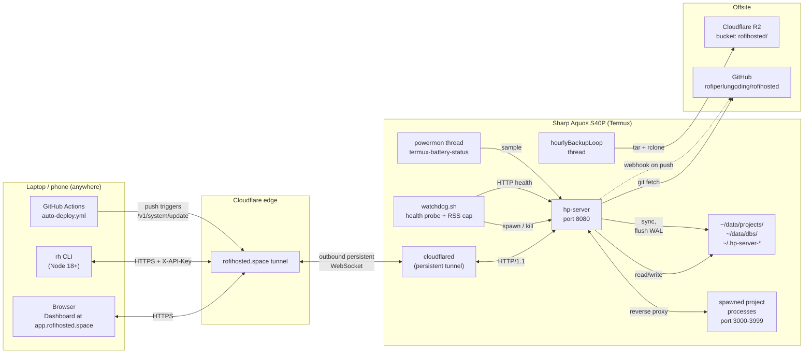
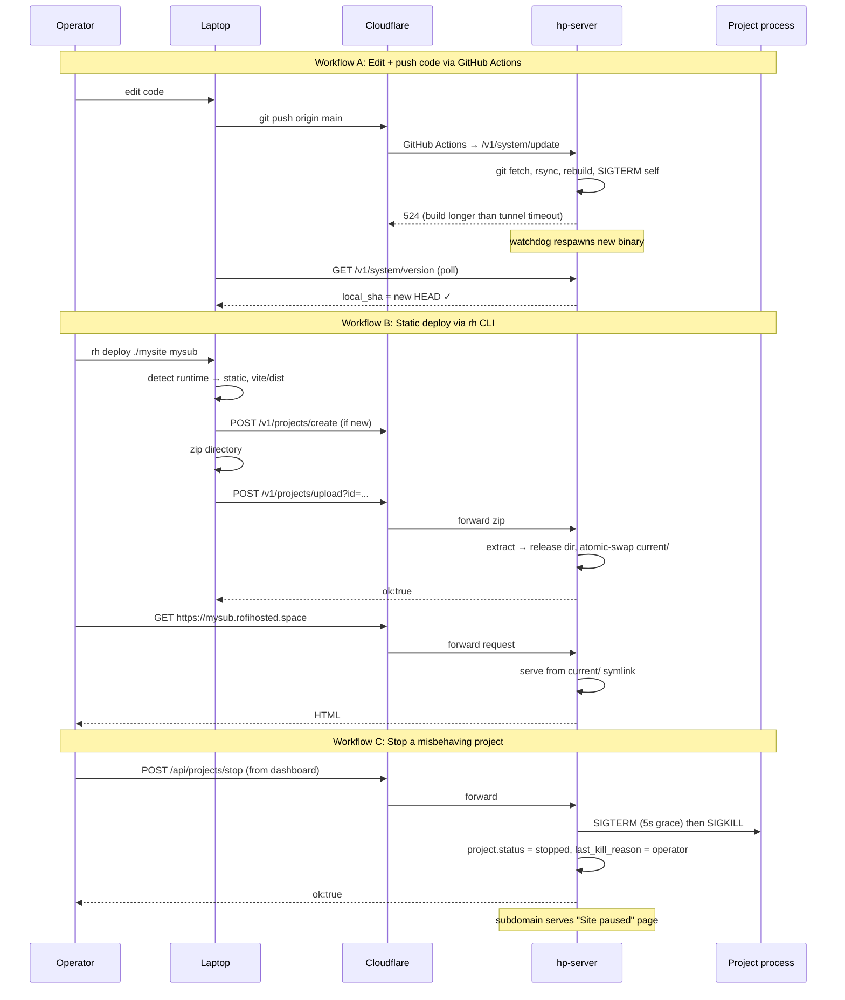
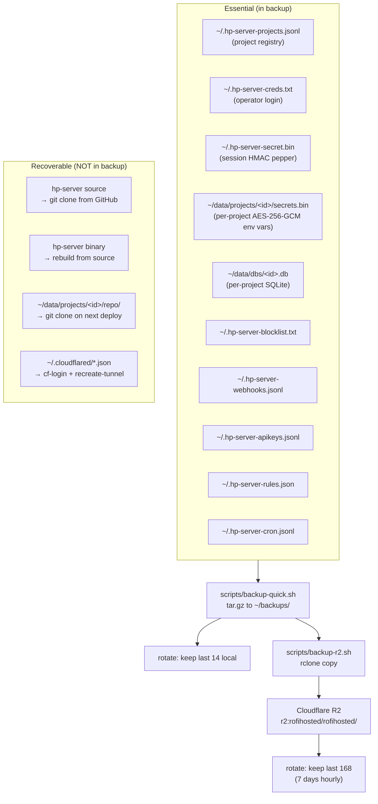
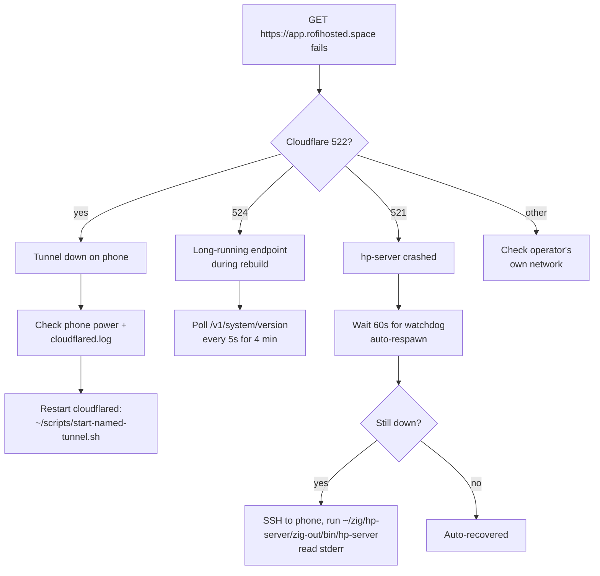
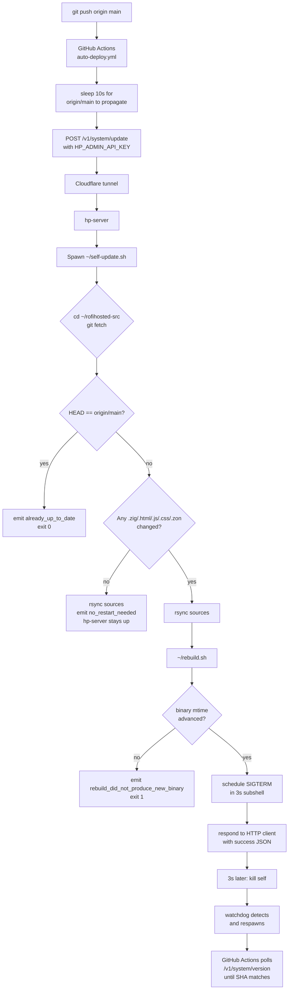
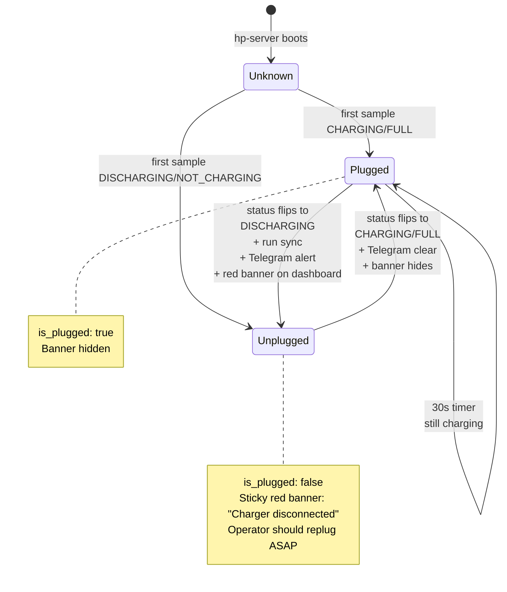

# Operations Manual

This is the day-to-day reference for running rofihosted on a Sharp Aquos
S40P. It assumes the system is already deployed; for first-time setup see
`docs/RECOVERY.md`, and for architectural rationale see
`docs/ARCHITECTURE.md`.

## Table of contents

- [System topology](#system-topology)
- [Operator surfaces](#operator-surfaces)
- [Daily workflows](#daily-workflows)
- [Backup and restore](#backup-and-restore)
- [Incident playbooks](#incident-playbooks)
- [Self-update flow](#self-update-flow)
- [Power monitoring](#power-monitoring)
- [Resource quotas](#resource-quotas)
- [Audit trail](#audit-trail)
- [Verification matrix](#verification-matrix)

---

## System topology



### Single-node assumptions

- One operator (`mrofid`). No multi-tenant.
- One physical device. If the device dies, recovery is manual via R2 backup.
- All persistent state lives in `~/data/` and `~/.hp-server-*` under the
  Termux user home.

### Outbound-only networking

The phone never accepts inbound connections directly. cloudflared maintains
an outbound persistent connection to Cloudflare, which proxies all
`*.rofihosted.space` traffic through the tunnel. This means:

- The phone can move between Wi-Fi and cellular networks without DNS or IP
  changes.
- No port forwarding, no static IP needed.
- If the Cloudflare tunnel goes down, the phone is unreachable but local
  state is intact.

---

## Operator surfaces

There are four ways to interact with the system, in order of access scope:

| Surface | Auth | Use for |
|---------|------|---------|
| Web dashboard at `app.rofihosted.space` | Session cookie (login form) | Day-to-day project management, settings, viewing logs |
| Web shell at `app.rofihosted.space/shell` | Same session cookie | Replaces SSH for arbitrary command execution |
| `rh` CLI on laptop | X-API-Key (admin scope) | Scripted operations, deploys, status checks |
| GitHub Actions | Repository secret `HP_ADMIN_API_KEY` | CI auto-deploy on push to main |

Direct SSH still works (key-based, port 8022) but is no longer required for
any documented workflow.



---

## Daily workflows

### Deploy a new static site

```sh
# Laptop
rh deploy ./build my-portfolio
# → autodetects Vite/CRA/Astro, claims subdomain, uploads, returns URL
```

### Edit hp-server source and ship

```sh
# Laptop, in repo
git push origin main
# → GitHub Actions hits /v1/system/update
# → phone fetches, rebuilds (90s for Zig changes, instant for scripts/docs)
# → phone respawns with new binary
# → CI verifies new SHA via /v1/system/version
# → green check
```

### Quick health check from anywhere

```sh
rh status
# →
# hp-server status
#   version    33fbc22 (up to date)
#   binary     built 29/05/2026, 07.07.41
#   battery    90% full
#   memory     2463 / 7573 MB
#   disk       80.4 / 93.4 GB free
#   uptime     2d 19h
```

### Run an ad-hoc command without SSH

Open `https://app.rofihosted.space/shell`. Type any shell command. Output
streams back, capped at 256 KB and 60s by default.

Quick-action chips on the page cover common operations: `~/rebuild.sh`,
`ps -ef`, `disk usage`, `~/logs/hp-server.log`, `~/logs/cloudflared.log`,
`~/data/projects/`, `git log`, `termux-battery-status`, `bash ~/backup-quick.sh`,
`ls ~/backups`, `/health`.

### Stop a project temporarily

Dashboard → Projects → click project → Stop button.
- Static project: subdomain returns 503 with "Site paused" page.
- Backend project: SIGTERM (5s grace), then SIGKILL. Auto-restart paused for 30s.

Restart with the Start button.

---

## Backup and restore

### What gets backed up



### Schedule

```mermaid
gantt
  title Backup cadence (typical day)
  dateFormat HH:mm
  axisFormat %H:%M
  section Local
  hp-server boot                  :crit, 00:00, 5m
  Hourly backup-quick (auto)      :04:00, 5m
  Hourly backup-quick (auto)      :05:00, 5m
  Hourly backup-quick (auto)      :06:00, 5m
  section R2
  hourlyBackupLoop fires backup-r2 :crit, 04:00, 10m
  hourlyBackupLoop fires backup-r2 :crit, 05:00, 10m
  hourlyBackupLoop fires backup-r2 :crit, 06:00, 10m
  section Manual
  Operator clicks Backup to R2    :milestone, 12:30, 0m
  Operator clicks Validate backup :milestone, 12:35, 0m
```



The hourlyBackupLoop thread inside hp-server runs `~/backup-r2.sh` every
3600 seconds with a 5-minute initial delay (so it doesn't fight boot-time
project respawn). Each invocation:

1. Calls `~/backup-quick.sh` to produce `~/backups/rofihosted-<ts>.tar.gz`
2. `rclone copy` uploads to `r2:rofihosted/rofihosted/<ts>.tar.gz`
3. Local: rotate, keep last 14
4. Remote: `rclone lsf | sort | head -n -168 | xargs rclone delete` → keep last 168

### Validate a backup

Dashboard → Settings → Backups card → click "Validate backup".
- If R2 configured, downloads the latest remote tarball, extracts to a
  temp dir, counts registry lines and DBs.
- Otherwise validates the latest local tarball.
- Returns size, registry_lines, db_count, db_total_bytes.
- Cleans up temp dir on exit.

### Restore on a fresh phone

See `docs/RECOVERY.md` for the full step-by-step. Summary:

1. Install Termux on new device, pkg install git openssh openssl-tool curl unzip nodejs python proot termux-api zip rsync rclone
2. `git clone https://github.com/rofiperlungoding/rofihosted ~/rofihosted-src`
3. Pull the latest tarball from R2 manually:
   `rclone copy r2:rofihosted/rofihosted/<latest>.tar.gz ~/`
4. `cd ~ && tar xzf <latest>.tar.gz` (puts back .hp-server-*, data/dbs/, secrets.bin)
5. `~/scripts/install-zig-014.sh` then `~/scripts/cf-login.sh` and `~/scripts/recreate-tunnel.sh`
6. `~/rebuild.sh && ~/scripts/watchdog.sh &`
7. Verify with `~/test-everything.sh`

---

## Incident playbooks

### Phone is unreachable



### Charger fell out

The powermon thread polls `termux-battery-status` every 30s. On detecting
the transition CHARGING/FULL → DISCHARGING/NOT_CHARGING:

1. Logs `powermon: charger disconnected`
2. Runs `sync` to flush filesystem buffers (this device bootloops on
   prolonged unplug, so we want WAL flushed before potential power loss)
3. Fires Telegram alert (rate-limited to 1/60s) if configured
4. Renders a sticky red banner on the dashboard

Operator action: replug the charger. The phone will reboot if power was
fully lost; watchdog respawns hp-server, project supervisor reaps any
orphan PIDs, and projects with status=running auto-restart.

### Project is OOM-looping

Symptom: Project keeps crashing, RAM pill turns red, `last_kill_reason`
shows `rss_quota`.

Steps:

1. Dashboard → click project → Logs → Runtime log to find the leak
2. Config tab → raise RAM limit if the cap is genuinely too tight
3. Or fix the leak in your code and redeploy

If the supervisor's auto-restart loop sees three OOM kills in a row, it
backs off exponentially (5s → 10s → 20s ... up to 60s) before respawning.

### Forgot to set R2 credentials

Symptom: hourly backup logs `R2_BUCKET not set in ~/.hp-server.env`.

```sh
# In /shell on dashboard:
R2_ACCOUNT_ID="..." R2_ACCESS_KEY_ID="..." R2_SECRET_ACCESS_KEY="..." R2_BUCKET="rofihosted" bash ~/r2-setup.sh
```

Test: `rclone lsd r2:rofihosted` should list the bucket.

---

## Self-update flow



### Why three classes of update

| Class | Trigger | Result |
|-------|---------|--------|
| `already_up_to_date` | HEAD already at remote | Returns in <1s, no rebuild, no restart |
| `no_restart_needed` | Only scripts/docs changed | Sources rsync'd, no rebuild needed, hp-server keeps running |
| `updated` (full) | Zig/template/JS/CSS/zon changed | Sources rsync'd, rebuilt, hp-server killed and respawned |

This minimizes downtime: 95% of operator commits are scripts or docs and
never bounce hp-server.

---

## Power monitoring

This device has a faulty charging IC that bootloops on unplug. The
powermon module is built around that constraint.



### Telegram setup

Optional but strongly recommended. To enable:

```sh
# In /shell:
~/scripts/set-telegram.sh
```

Follow the prompts to register a Telegram bot via @BotFather, get a chat
ID, and write to `~/.hp-server.env`.

---

## Resource quotas

Per-project RSS limit caps memory at the supervisor level.

```mermaid
sequenceDiagram
  participant sup as Supervisor (5s loop)
  participant proc as Project process
  participant fs as /proc/&lt;pid&gt;/status

  loop every 5 seconds
    sup->>fs: read VmRSS
    fs-->>sup: e.g. 312000 KB
    alt under limit
      sup->>sup: over_quota_count = 0
    else over limit
      sup->>sup: over_quota_count++
      alt count >= 2
        sup->>proc: SIGTERM
        sup->>sup: last_kill_reason = rss_quota
        Note over sup: autoRestart respawns<br/>with backoff
      end
    end
  end
```

### Setting a limit

Dashboard → click project → Config tab → "RAM limit (MB)" → click a
preset chip (128, 256, 384, 512) or type a custom number → click Save.

Static projects ignore the setting (they have no spawned process to cap).

The "RAM 142 MB / 256 (55%)" pill on the meta row updates every 5s and
turns amber at 75% and red at 90%.

---

## Audit trail

Every privileged action is recorded in `~/.hp-server-audit.jsonl`. View
recent entries via `GET /api/audit?limit=100`.

Actions logged:
- `login`, `logout`, `login_failure`
- `block_ip`, `unblock_ip`, `change_credentials`
- `digest_run`, `geoblock_update`
- `project_create`, `project_update`, `project_delete`, `project_delete_purge`
- `project_start`, `project_stop`, `project_restart`, `project_deploy`
- `project_secret_set`, `project_secret_delete`
- `apikey_create`, `apikey_revoke`
- `webhook_create`, `webhook_delete`
- `system_exec` (with first 200 chars of command)
- `system_backup`, `system_update`, `system_restore_test`

Each entry has a Unix timestamp, actor (username from session or API key
name), action, target identifier, optional detail string, and ok flag.

---

## Verification matrix

`scripts/test-everything.sh` runs all 48 checks below. Designed to be run
on the phone via SSH or `/shell`.

| Category | Check | What it tests |
|----------|-------|---------------|
| Auth | session login | Login form returns 302 |
| | admin API key created | /api/apikeys/create with admin scope |
| Pages | / /status /files /api /projects /security /settings /shell | All sidebar pages return 200 |
| | /health | Public health endpoint |
| | /login (apex) | Public landing |
| System (cookie) | /api/system/info | Battery, mem, disk, uptime |
| | /api/system/power | Charger status |
| | /api/system/version | Local + remote SHA |
| | /api/system/backups | Lists local + R2 |
| | /api/system/backup local | Triggers backup-quick.sh |
| | /api/system/restore-test local | Validates a tarball |
| | /api/system/exec (echo) | Shell exec |
| | /api/system/exec (timeout) | SIGTERM at deadline |
| V1 (admin key) | /v1/whoami | Key identity |
| | /v1/system/version | Mirror of /api/system/version |
| | /v1/system/info | Mirror |
| | /v1/system/power | Mirror |
| | /v1/projects | Project list |
| | scope enforcement | sql-only key on /v1/system/* gets 403 |
| Project | v1 projects create | Create static project |
| | v1 projects list | Sees new project |
| | set rss_limit_mb | Update with quota |
| | rss_limit_mb persisted | Survives round-trip |
| | v1 projects status (rss fields) | rss_kb, rss_limit_mb, last_kill_reason |
| | stop static project | Sets status=stopped |
| | start static project | Flips back to running |
| | delete with purge | Removes registry + files + DB |
| Deploy | v1 deploy: project created | Static project via /v1/projects/create |
| | v1 deploy: upload | ZIP through /v1/projects/upload |
| | v1 deploy: site reachable through CF | Public URL serves the deployed file |
| Backup | local backup | Creates tarball, lists in /api/system/backups |
| | R2 configured | r2_configured=true |
| | R2 backup upload | rclone copy succeeds |
| | R2 backup visible | New file in remote list |
| Powermon | battery readable | Returns valid percentage and is_plugged |
| Audit | trail readable | /api/audit returns entries |
| | logs system_backup | Recent backup recorded |
| | logs project_create | Recent create recorded |

Run it any time:

```sh
ssh hp 'bash ~/test-everything.sh'
```

Expected output ends with `48 / 48 passed   All green.`

---

## Quick reference: file locations on phone

| Path | Owner | Purpose |
|------|-------|---------|
| `~/zig/hp-server/` | source + build cache | hp-server source tree |
| `~/zig/hp-server/zig-out/bin/hp-server` | binary | compiled server |
| `~/rofihosted-src/` | clone of GitHub repo | self-update fetches here, then rsyncs to ~/zig/hp-server/ |
| `~/data/projects/<id>/` | per project | working tree, releases, logs, secrets vault, runtime.pid |
| `~/data/dbs/<id>.db` | per project | SQLite DB for auth + app data |
| `~/.hp-server-projects.jsonl` | registry | JSON-lines list of projects |
| `~/.hp-server-creds.txt` | auth | operator username:bcrypt(password) |
| `~/.hp-server-secret.bin` | auth | 32-byte HMAC pepper |
| `~/.hp-server-blocklist.txt` | security | banned IPs |
| `~/.hp-server-apikeys.jsonl` | api | issued API keys |
| `~/.hp-server-webhooks.jsonl` | api | outbound webhook configs |
| `~/.hp-server-rules.json` | security | operator-defined rules |
| `~/.hp-server-cron.jsonl` | scheduling | per-project cron tasks |
| `~/.hp-server-audit.jsonl` | audit | append-only action log |
| `~/.hp-server.env` | config | TG_BOT_TOKEN, R2_BUCKET, MISTRAL_API_KEY, etc |
| `~/.cloudflared/<tunnel-id>.json` | tunnel | tunnel credentials |
| `~/.cloudflared/cert.pem` | tunnel | account cert |
| `~/.config/rclone/rclone.conf` | tunnel | R2 endpoint + access keys |
| `~/backups/rofihosted-<ts>.tar.gz` | backup | local snapshots (last 14) |
| `~/logs/hp-server.log` | runtime | std out + err of hp-server |
| `~/logs/cloudflared.log` | runtime | tunnel logs |
| `~/logs/watchdog.log` | runtime | watchdog actions |
| `~/logs/self-update.log` | runtime | self-update.sh diagnostics |

---

## Quick reference: ports

| Port | Bound by | Visibility |
|------|----------|------------|
| 8080 | hp-server (httpz) | localhost-only |
| 3000-3999 | project supervisors | localhost-only, allocated per project |
| 8022 | sshd (Termux) | LAN-only (recovery surface) |
| n/a | cloudflared | outbound only, no listen |

All public traffic enters via cloudflared and is proxied to localhost:8080
or localhost:&lt;project_port&gt; based on the Host header subdomain.
