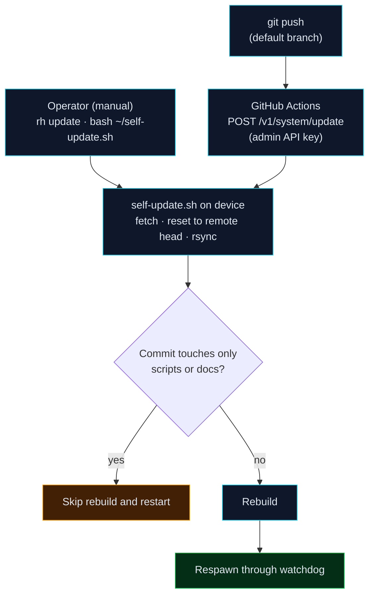
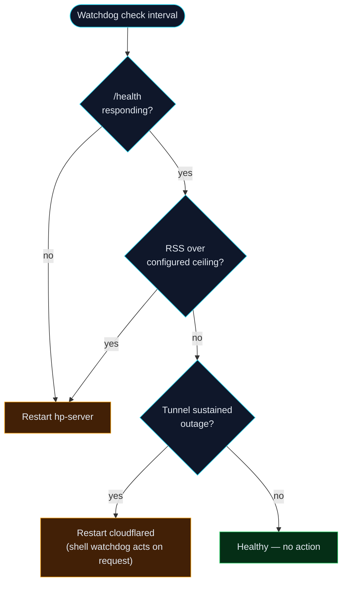
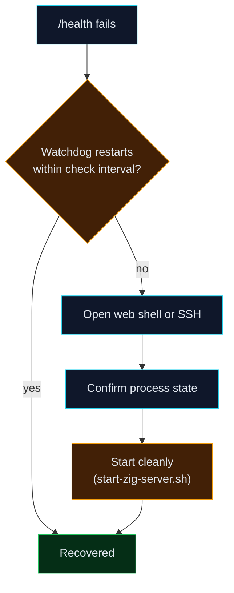

# Operations

This is the operator's manual for running rofihosted day to day: how to deploy,
where to manage the system from, how backups work, how to respond to common
incidents, and how to verify the system after a change. It consolidates the
former metrics-testing checklist.

---

## 1. Management surfaces

There are four ways to operate the system, in rough order of routine use.

| Surface | Authentication | Use for |
|---------|----------------|---------|
| Operator console — `admin.rofihosted.space` | Session cookie (admin) | Day-to-day work: projects, settings, security, logs, web shell |
| Web shell — `admin.rofihosted.space/shell` | Session cookie (admin) | Arbitrary commands; replaces SSH for most tasks |
| `rh` CLI (workstation) | `X-API-Key` (admin scope) | Scripted operations, status checks, deploys |
| GitHub Actions | Repository secret (admin scope) | Automatic deploy on every push to the default branch |

Direct SSH (key-based, port 8022, LAN-only) remains available as a last resort
but is not required for any documented workflow.

---

## 2. Deploying a change

The normal path is fully automated:

1. Push to the default branch on GitHub.
2. GitHub Actions calls `POST /v1/system/update` on the device with the admin
   API key.
3. The device runs `self-update.sh`: fetch, reset to the remote head, rsync
   sources into the build tree, rebuild, and respawn through the watchdog.
4. Commits that touch only scripts or documentation skip the rebuild and
   restart.

The automated path, end to end:



To deploy manually from the console or `rh`:

```sh
rh update          # from a workstation
# or, in the web shell:
bash ~/self-update.sh
```

**Verify after deploy:**

```sh
curl -s https://rofihosted.space/health        # expect: ok
curl -s https://status.rofihosted.space/api/status | head -c 200
```

Confirm exactly one server process is running and the binary timestamp
advanced:

```sh
pgrep -af 'bin/hp-server$'
ls -la ~/zig/hp-server/zig-out/bin/hp-server
```

> **Process hygiene.** Lifecycle scripts must match the process consistently to
> avoid leaving duplicate instances competing for the port. If two
> `hp-server` processes are ever observed, stop all of them and start one
> cleanly. Standardizing this is tracked in the engineering review (P0-1).

---

## 3. Configuration and secrets

Runtime configuration lives in mode-600 files in the device home directory,
never in the repository. The environment file (`~/.hp-server.env`) holds
third-party credentials (Mistral, Brevo, Telegram, R2) and the operator
credentials. It is sourced into the process environment at startup.

Helper scripts manage individual settings without clobbering the rest of the
file, for example:

```sh
bash ~/scripts/set-email.sh <brevo-api-key> <verified-sender> rofihosted
bash ~/scripts/set-telegram.sh <bot-token> <chat-id>
```

After changing configuration, restart the server so the new environment is
loaded.

---

## 4. Backups

- **Local snapshots** (`scripts/backup-quick.sh`) — a tarball of the registry,
  per-project databases, secrets vaults, the pepper, and all JSONL data,
  rotated to the most recent fourteen.
- **Offsite** (`scripts/backup-r2.sh`) — the same snapshot copied to a private
  Cloudflare R2 bucket via `rclone`, rotated to the most recent 168 (seven days
  hourly). An in-process thread triggers this hourly.
- The Settings page can trigger either backup, list both, and validate that a
  snapshot is restorable.

Because backups contain the pepper and secrets, they are as sensitive as the
device. Keep the R2 bucket private. Perform a restore drill periodically; see
`RECOVERY.md`.

---

## 5. Monitoring

- **Public status** — `status.rofihosted.space` shows overall state and
  per-component status with recent uptime bars, computed from first-party
  signals (`/api/status`).
- **Operator status** — the console's Status page shows the in-depth view:
  probe results, tunnel internals, process and thread health, and response-code
  breakdowns.
- **Alerts** — optional Telegram notifications fire on power events
  (charger disconnect), downtime transitions, and pending signups.

> External reference probes (Google, GitHub, Cloudflare) can report false
> failures under Termux DNS and should not be treated as outages of this
> system. Reducing this noise is tracked in the engineering review (P0-3).

---

## 6. Incident playbooks

The watchdog self-heals across the conditions below before any manual action is
needed:



**Server not responding (`/health` fails).** The watchdog should restart it
within its check interval. If it does not, open the web shell or SSH, confirm
the process state, and start it cleanly:

```sh
pkill -f 'bin/hp-server$'; sleep 2; bash ~/start-zig-server.sh
```

Escalation path when the automatic restart does not recover it:



**Tunnel down (edge returns 530).** Check `cloudflared`:

```sh
pgrep -af cloudflared
tail -50 ~/logs/cloudflared.log
```

The tunnel-health watchdog requests a restart after a sustained outage; the
shell watchdog acts on that request.

**Memory pressure.** The watchdog restarts the server if its RSS exceeds the
configured ceiling. Investigate the cause (a runaway project process is the
usual culprit) via the Security and Projects pages.

**Failed deploy.** If a build fails on the device, the previous binary may
still be running. Re-run the update after fixing the cause. A last-known-good
binary fallback is recommended; see the engineering review (P0-2).

**Suspected compromise / abuse.** Review the Security page and audit log,
block offending IPs, and if a credential may be exposed, change the operator
password (which rotates all sessions) and revoke affected API keys.

---

## 7. Verification suite

After any change, run the end-to-end verification on the device:

```sh
bash ~/test-everything.sh
```

It exercises authentication, infrastructure, system endpoints, the `/v1` API,
the project lifecycle and deploy pipeline, backups, the power monitor, and
auditing. Clean it up after.

For routing and surface behaviour specifically, confirm:

- `rofihosted.space/` returns the landing page; `/health` returns `ok`.
- `status.rofihosted.space/` renders and `/api/status` reports `operational`.
- `admin.rofihosted.space/` redirects unauthenticated requests to login, and
  serves the console after an admin login.
- `app.rofihosted.space/` requires authentication.
- Static assets and fonts load (`/theme.css`, `/app.css`,
  `/fonts/SFProDisplay-*.woff2`).

---

## 8. Routine tasks reference

| Task | Where |
|------|-------|
| Create / deploy a project | Console → Projects |
| Roll back a release | Console → Projects → project → Releases |
| Run SQL against a project DB | Console → Projects → project → Database |
| Add a scheduled task | Console → Projects → project → Scheduled tasks |
| Create / revoke an API key | Console → Settings → API keys |
| Configure webhooks | Console → Settings → Webhooks |
| Edit operator rules | Console → Settings → Rules |
| Toggle geo-block / honeypot | Console → Settings |
| Trigger a backup | Console → Settings → Backups |
| Run an arbitrary command | Console → Shell |
