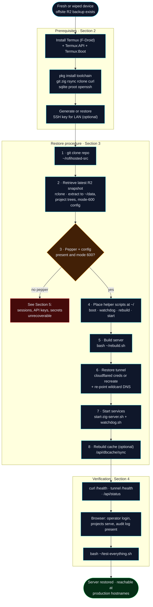

# Disaster Recovery

This runbook describes how to restore rofihosted onto a fresh device from
backups. It assumes the previous device is lost or wiped and that an offsite
backup exists in Cloudflare R2 (or a local snapshot is at hand).

Recovery objective: a working server, reachable at the production hostnames,
with all projects, users, credentials, and history intact.

## Single-device SPOF, RTO, and RPO

Be honest about the reliability model: the entire platform — control plane, all
tenant projects, and the secret material — runs on **one phone**. That phone is
a **single point of failure**. The battery acts as a built-in UPS for power
continuity, and the watchdog restarts crashed processes, but neither helps if
the OS itself is killed, storage corrupts, or the hardware fails. This is an
accepted trade-off for a personal/portfolio system; it is **not** a
high-availability design and should not be presented as one.

- **RPO (data loss window):** at most the interval since the last good backup.
  Append-only JSONL plus per-project DBs are snapshotted to Cloudflare R2 hourly
  and rotated locally, so the realistic RPO is **≤ 1 hour**.
- **RTO (time to restore):** a manual bring-up onto a fresh device per the
  procedure below — realistically **30–90 minutes**, dominated by installing the
  toolchain and the first on-device build.
- **Mitigation:** keep the R2 snapshot current, keep the pepper backed up (its
  loss is unrecoverable — Section 5), and run this runbook as a drill
  periodically so the RTO is real rather than theoretical.

The end-to-end bring-up sequence, from a fresh device to a verified server:



---

## 1. What a backup contains

A snapshot (`scripts/backup-quick.sh` / `backup-r2.sh`) includes everything
required to reconstitute the system:

- The per-install **pepper** (`~/.hp-server-secret.bin`) — without it, no
  session, password hash, API key, JWT, or project secret can be validated.
- Configuration files (credentials, blocklist, geo-block and honeypot toggles,
  rule set, API keys, webhooks, the environment file).
- The **project registry** and **cron schedule**.
- All **JSONL data** (visits, uptime, logins, audit, AI logs).
- Per-project **databases** and **secrets vaults**.
- The SQLite cache is *not* required (it is rebuilt from JSONL).

Because the snapshot contains the pepper and secrets, it is as sensitive as the
device. Keep the R2 bucket private.

---

## 2. Prerequisites on the new device

1. Install Termux (F-Droid), plus Termux:API and Termux:Boot.
2. Install the toolchain and utilities:
   ```sh
   pkg install git zig rsync rclone curl sqlite proot openssh
   ```
   (Match the Zig version pinned in `build.zig.zon`.)
3. Generate or restore the SSH key used for LAN access if desired.

---

## 3. Restore procedure

1. **Clone the source.**
   ```sh
   git clone https://github.com/rofiperlungoding/rofihosted ~/rofihosted-src
   ```

2. **Retrieve the latest backup.** Configure `rclone` for the R2 bucket
   (`scripts/r2-setup.sh`), then download and extract the newest snapshot into
   the home directory so that `~/data`, the project trees, and the mode-600
   configuration files are restored to their original locations.

3. **Verify the pepper and configuration are present** and have mode 600:
   ```sh
   ls -l ~/.hp-server-secret.bin ~/.hp-server.env ~/.hp-server-creds.txt
   ```

4. **Place the helper scripts** in the home directory (the boot, watchdog,
   rebuild, and start scripts are expected at `~/`).

5. **Build the server.**
   ```sh
   bash ~/rebuild.sh
   ```

6. **Restore the tunnel.** Reinstall `cloudflared` credentials, or recreate the
   named tunnel and re-point the DNS records (`scripts/recreate-tunnel.sh`,
   `scripts/cf-route-wildcard.sh`). The wildcard `*.rofihosted.space` CNAME must
   resolve to the tunnel; the apex and reserved subdomains are handled inside
   the server.

7. **Start services.**
   ```sh
   bash ~/start-zig-server.sh
   setsid nohup ~/watchdog.sh > ~/logs/watchdog.log 2>&1 < /dev/null &
   ```

8. **Rebuild the cache** (optional; it self-heals on the next sync):
   ```sh
   curl -s http://127.0.0.1:8080/api/dbcache/sync
   ```

---

## 4. Verification

```sh
curl -s http://127.0.0.1:8080/health                 # ok
curl -s https://rofihosted.space/health              # ok (through the tunnel)
curl -s https://status.rofihosted.space/api/status   # operational
```

Then confirm, from a browser:

- An operator login at `admin.rofihosted.space` succeeds and the console
  renders.
- Projects appear in the console and their subdomains serve.
- The audit log and history are present (proves data restore).

Run the full suite to be sure:

```sh
bash ~/test-everything.sh
```

---

## 5. If the pepper is lost

The pepper cannot be regenerated. Without it:

- All existing sessions, API keys, and per-project secrets and JWTs are
  unrecoverable.
- The operator password must be reset (it lives in the credentials file, which
  is restored separately, so this only applies if both are lost).
- Each project's encrypted secrets must be re-entered.

This is why the pepper is the single most important item in every backup.
Confirm it is included and restorable as part of routine backup validation.

---

## 6. Routine recovery drills

Periodically validate that backups are restorable without waiting for a real
disaster:

- Use the Settings page or `scripts/verify-backup.sh` to download the latest
  R2 snapshot, verify the tarball integrity, confirm the critical files are
  present, and check SQLite database integrity.
- At least once, perform a full restore onto a spare device or an emulator to
  confirm this runbook is accurate end to end.
