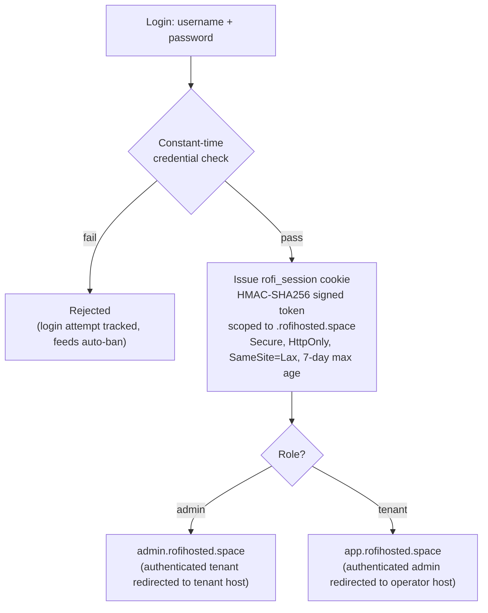
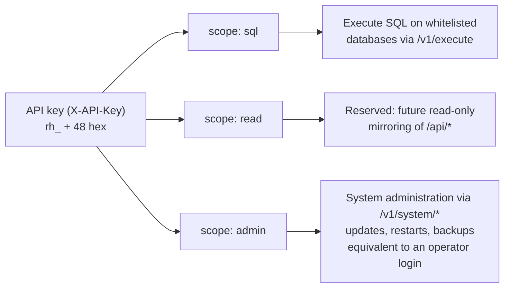
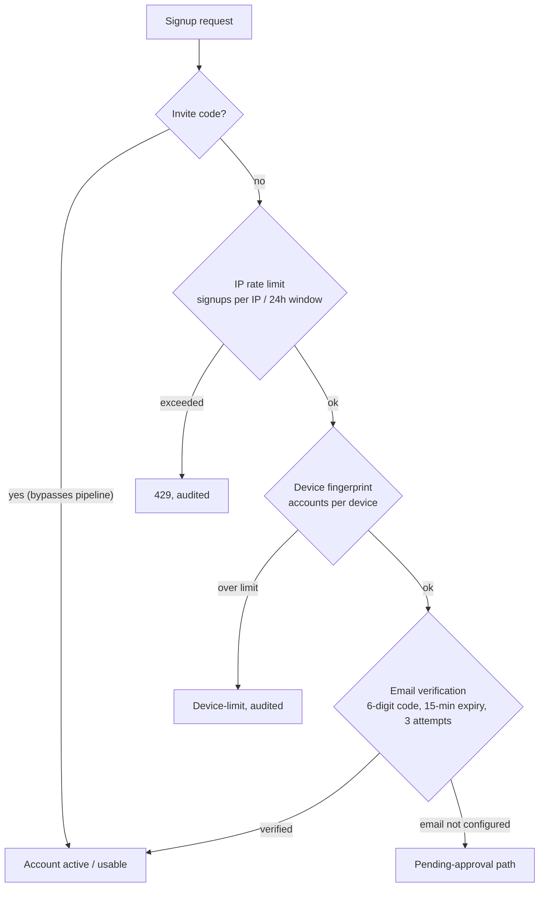
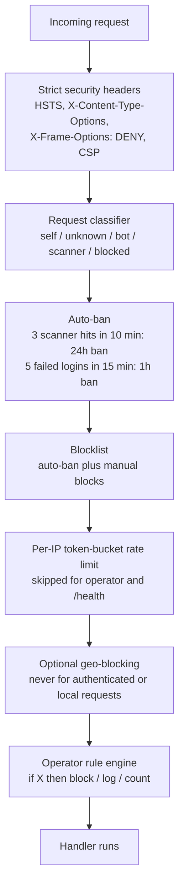

# Security

This document is the canonical reference for rofihosted's security model. It
describes the threat model, authentication and session management, access
control across the four public surfaces, the programmatic API-key system, the
signup anti-abuse pipeline, secrets handling, and the network controls applied
to every request. It consolidates material previously kept in separate
anti-duplicate and API-key notes.

---

## 1. Threat model

rofihosted is a single-operator system exposed to the public internet. The
relevant adversaries and assumptions are:

- **Opportunistic scanners and bots.** The dominant traffic. They probe for
  known-vulnerable paths (`/.env`, `/wp-login.php`, exposed Git configs).
  Mitigated by classification, auto-ban, and rate limiting.
- **Credential attackers.** Brute-force or credential-stuffing against the
  login. Mitigated by constant-time comparison, login-attempt tracking, and
  auto-ban after repeated failures.
- **Abusive sign-ups.** Automated or duplicate account creation. Mitigated by
  the three-layer anti-abuse pipeline (Section 5).
- **Application-layer attacks** against hosted projects (path traversal, header
  spoofing). Mitigated by the path-safety module and strict IP handling.

Out of scope: a determined attacker with physical access to the unlocked
device, or compromise of Cloudflare itself. The device is assumed to be
physically controlled by the operator.

Public reachability is mediated entirely by the Cloudflare Tunnel. The device
exposes no inbound port to the local network or the internet; all traffic
arrives through `cloudflared`.

---

## 2. Authentication and sessions

Sessions are carried in a single cookie, `rofi_session`, scoped to
`.rofihosted.space` with the attributes `Secure`, `HttpOnly`,
`SameSite=Lax`, and a seven-day maximum age. The cookie value is an
HMAC-SHA256-signed token, not a server-side session reference, so there is no
session store to compromise.

Two token formats coexist:

- **Legacy operator (v1).** Signing key is
  `SHA-256("rofi.session.v1:" || password || ":" || username || ":" || pepper)`.
  Credentials live in a mode-600 file. Changing the password rotates the key
  and instantly invalidates all existing sessions.
- **Multi-user (v2).** Token is `v2.<payload>.<signature>` where the payload is
  `<expiry>:<user_id>`. The signing key is derived per user:
  `SHA-256("rofi.session.v2:" || user_id || ":" || password_hash || ":" || pepper)`.
  Because the key includes the user's password hash, a password change
  immediately invalidates that user's cookies. Verification re-derives the key
  from the looked-up user record on every request.

Both formats verify the signature in constant time and check expiry. The two
namespaces cannot collide.

The login-to-landing flow ties the session cookie above to the role-based routing described in Section 3:

### Password storage

Multi-user passwords are stored as `HMAC-SHA256(pepper, salt || ":" ||
password)` with a 16-byte random salt per user, hex-encoded in the record.
Login comparison is constant-time. (A migration to a memory-hard function such
as Argon2id is desirable and noted as future work.)

### The pepper

A 32-byte random value generated once on first boot and stored mode-600 at
`~/.hp-server-secret.bin`. It underpins session HMACs, password hashes,
API-key hashes, per-project JWT signing keys, and the per-project secrets
vault. It is never transmitted and never committed. Loss of the pepper
invalidates all derived secrets — it is included in backups.

---

## 3. Access control

Access is enforced at two independent layers:

1. **Host layer.** `admin.rofihosted.space` requires `role = admin`; an
   authenticated tenant is redirected to the tenant host.
   `app.rofihosted.space` requires authentication; an authenticated admin is
   redirected to the operator host for page navigations.
2. **Route layer.** Sensitive endpoints (`/admin/*`, `/api/users*`,
   `/api/invites*`, `/api/system/*`) carry an explicit `role = admin` check
   regardless of the host they are reached on.

This redundancy is deliberate: a routing mistake at one layer does not, by
itself, expose privileged functionality. Role-based redirects use `302` (not
cacheable) so a browser never caches a decision that depends on the current
session.

---

## 4. Programmatic API keys

External tools and automation authenticate to the `/v1/*` API with an
`X-API-Key` header rather than a session cookie.

- **Format:** `rh_` followed by 48 hex characters.
- **Storage:** keys are never stored in plaintext. The full token is hashed
  with `SHA-256("rh.apikey.v1:" || pepper || ":" || token)` and only the hash
  is persisted (append-only, mode 600). A leaked key file cannot authenticate
  on its own.
- **Verification:** constant-time comparison (`timingSafeEql`) across active
  keys. Revoked keys carry a `revoked_at` timestamp and are skipped.
- **Scopes:**
  - `sql` — execute SQL on whitelisted databases via `/v1/execute`.
  - `read` — reserved for future read-only mirroring of `/api/*`.
  - `admin` — system administration (`/v1/system/*`): triggering updates,
    restarts, and backups. **This scope is equivalent to an operator login.**
    Issue it only to trusted automation (for example, the GitHub Actions deploy
    pipeline), and store it as a repository secret, never in the codebase.

How the three scopes map to what they permit:

Any `/v1/*` request carrying an `X-API-Key` header is exempted from the visitor
classifier and auto-ban, so a malformed automation request cannot ban the
operator's own address.

---

## 5. Signup anti-abuse pipeline

Public signup (without an invite code) passes through three independent layers
before an account becomes usable. An invite code bypasses the pipeline and
activates the account immediately.

1. **IP rate limiting.** A maximum number of signups per source IP per rolling
   24-hour window. Exceeding it returns `429` and is audited.
2. **Device fingerprinting.** A best-effort device signature limits the number
   of accounts a single device can create, catching the common case of one
   client cycling addresses.
3. **Email verification.** A six-digit code with a fifteen-minute expiry and a
   three-attempt limit, delivered through the transactional-email provider
   (Section 7 of the architecture). Until verification succeeds, the account
   remains pending and cannot be used. If email is not configured, this layer
   is skipped and the account follows the pending-approval path.

All signup outcomes — success, rate-limit, device-limit, and pending — are
recorded in the audit log.

The signup pipeline and its outcomes:

---

## 6. Network and request controls

Applied to every request, before any handler runs:

- **Strict security headers** on all responses: HSTS, `X-Content-Type-Options`,
  `X-Frame-Options: DENY`, a referrer policy, a permissions policy, and a
  Content Security Policy. (Tightening the CSP to remove `unsafe-inline` is
  tracked in the engineering review.)
- **Request classifier** assigning each request to `self`, `unknown`, `bot`,
  `scanner`, or `blocked` from path heuristics, user agent, and browser
  fingerprint.
- **Auto-ban.** Three scanner hits within ten minutes earns a 24-hour ban; five
  failed logins within fifteen minutes earns a one-hour ban. Bans feed the same
  blocklist used for manual blocks.
- **Per-IP token-bucket rate limiting**, skipped for the operator and
  `/health`.
- **Optional geo-blocking** driven by the Cloudflare country header, never
  applied to authenticated or local requests.
- **Operator rule engine** allowing declarative "if X then block/log/count"
  rules evaluated in the request path.

> **Client IP integrity.** Security decisions must be based only on the
> Cloudflare-provided client IP, because all legitimate traffic arrives through
> the tunnel. Trusting forwarded headers as a fallback would allow spoofing of
> the rate limiter and auto-ban. Hardening this is tracked in the engineering
> review (P1-3).

The controls applied to every request, before any handler runs:

---

## 7. Application-layer protections

- **Path safety.** `pathsafe.zig` validates every user-influenced path and
  subdomain: no null bytes, no control characters, no `..` segments, no
  backslashes, and — for filesystem access — a `realpath`-based check that the
  resolved target remains inside its root, which also defeats symlink escape.
  Hosted subdomains are restricted to `[a-z0-9-]`, 1–63 characters.
- **Prompt-injection defense.** All untrusted data passed to the AI layer is
  wrapped in delimited blocks and sanitized; system prompts instruct the model
  to treat that content strictly as data.
- **Per-project isolation.** Each project has its own SQLite database, its own
  AES-256-GCM secrets vault keyed to the pepper and project ID, and its own JWT
  signing key, so one project can neither read another's data nor mint tokens
  another would accept.
- **GitHub webhooks** are verified with HMAC-SHA256 and a constant-time
  comparison against a per-project secret.

---

## 8. Auditing

Every operator mutation is written to an append-only audit log with a
timestamp, actor, action, target, and outcome. Authentication attempts and
signup events are logged separately. Because the logs are append-only and
plain text, they are tamper-evident under normal operation and survive in
backups.

---

## 9. Secrets in backups

Backups include the pepper and the mode-600 configuration files, because they
are required to restore a working system. Backups are therefore as sensitive as
the device itself and are stored in a private Cloudflare R2 bucket. The system-
level environment file (third-party API keys) is currently plaintext on disk;
ensuring backups protect it and considering at-rest encryption for parity with
the project vault is tracked in the engineering review (P3-4).
